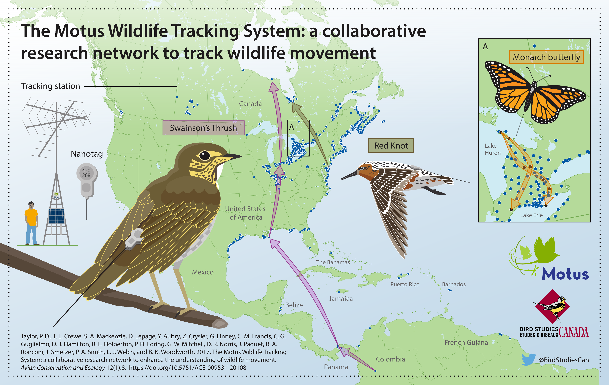
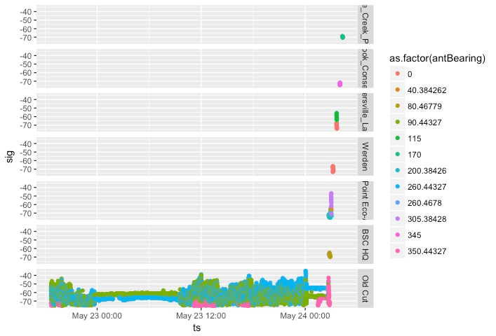
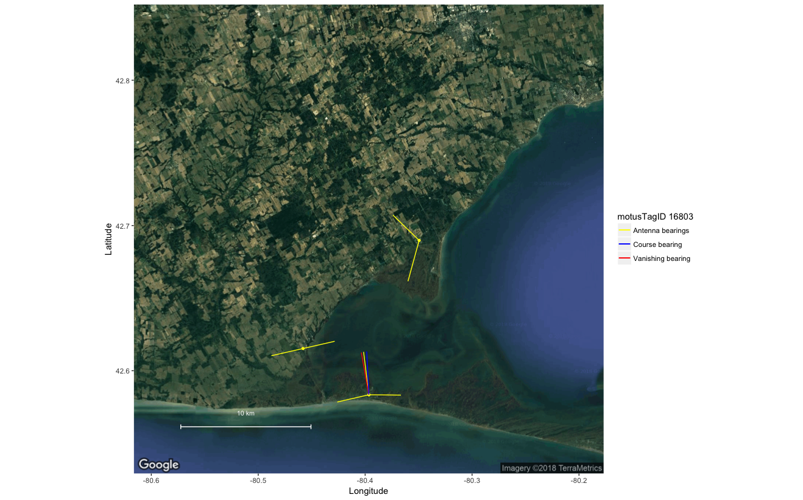

# A walk through the use of R for Motus automated radio-telemetry data  {-}

```{r coverimage, echo=FALSE, out.width="700px", fig.align='center'}
knitr::include_graphics("images/BSC_Motus_Logo.png")
```

Our goal with this online 'handbook' is to show Motus (<https://motus.org>) users how to use the R statistical programming language (<https://www.r-project.org/>) to import tag detections data for a project or receiver; clean data and filter false positives; explore detections data through visualizations and summaries; transform the data, e.g., by determining time since sunrise/sunset or magnetic declination; and run various analytical procedures. We hope the contents will be of use, and if you have suggestions for additional examples, please let us know by emailing motus@birdscanada.org. 

Published `r format(Sys.Date(), "%B %Y")`

<!--chapter:end:index.Rmd-->

# Introduction {#introduction}
```{r tidyr1, echo = FALSE, message = FALSE, warning = FALSE}

library(knitr)
opts_chunk$set(tidy.opts=list(width.cutoff=50), tidy = FALSE)

```

```{r fig1, echo=FALSE, fig.align='center'}

```

 <br>

The Motus Wildlife Tracking System ('Motus'; Taylor et al. 2017; <https://www.motus.org>) is an international, collaborative automated radio-telemetry network to track the movement and behaviour of flying organisms affixed with digitally encoded radio-transmitters. Motus was developed at Acadia University in 2012-2013. In 2014, a major infrastructure expansion was made possible through a Canada Foundation for Innovation grant to Western University, The University of Guelph, and Acadia University. Since then, Motus has grown through the collaboration of independent researchers and organizations (see <https://motus.org/about/>). It is now managed as a program of Bird Studies Canada (<https://www.birdscanada.org>) in partnership with Acadia University. 

Motus is unique among automated telemetry arrays in that all researchers in a geographic region (e.g., the Americas or Europe) use a shared radio frequency. This allows tagged animals to be detected by any receiving station across the network, greatly broadening the spatial scope of potential research questions. Motus users also use a shared data infrastructure and web portal: all data collected from across the network are centrally stored and archived, which allows users to access detections of their tags by anyone's receiver in the network, and individuals that maintain receivers have access to all detections of anyone's tags on those receivers.

Having a shared data infrastructure also means that users can benefit from R functions written specifically for Motus data by any and all users. The `motus` R package described in this book is in continual development, and the intent of this online 'handbook' is to help users learn the various functionalities of the package, and potentially contribute to it. We also show how additional R packages such as ggplot can be used to explore, visualize, transform, and analyze Motus data. 

The content of the handbook will continue to evolve and grow along with the analytical needs of the network. Those interested in contributing code to the Motus R package or this handbook can send proposed additions to motus@birdscanada.org.  

Taylor, P. D., T. L. Crewe, S. A. Mackenzie, D. Lepage, Y. Aubry, Z. Crysler, G. Finney, C. M. Francis, C. G. Guglielmo, D. J. Hamilton, R. L. Holberton, P. H. Loring, G. W. Mitchell, D. R. Noriis, J. Paquet, R. A. Ronconi, J. Smetzer, P. A. Smith, L. J. Welch, and B. K. Woodworth. 2017. The Motus Wildlife Tracking System: a collaborative research network to enhance the understanding of wildlife movement. Avian Conservation and Ecology 12(1):8. https://doi.org/10.5751/ACE-00953-120108.

## What this book does not cover {#whatBookCovers}

This book does not cover how to register radio tags with Motus, manage tags and station deployments, or upload raw detections data for processing. Information to guide you through those tasks can be found under the 'resources' tab on the Motus website at <https://motus.org/resources/>.  Please remember to register your tags **prior to deployment**, and enter tag and station metadata online in a timely manner. Please also review the Motus collaboration policy and tag registration and fee schedule at <https://motus.org/policy/>.

## Prerequisites {#prerequisites}

This book assumes that you have a basic understanding of R. Regardless of whether you are new to R or not, we highly recommend that you become familiar with 'R for Data Science' by Garrett Grolemund and Hadley Wickham (<http://r4ds.had.co.nz/>). Their book covers how to import, visualize, and summarize data in R using the tidyverse collection of R packages (<https://www.tidyverse.org/>). It also provides an invaluable framework for organizing your workflow to create clean, reproducible code (<http://r4ds.had.co.nz/workflow-projects.html>). We follow their lead by, wherever possible, using the tidyverse framework throughout this book.

## Sample datasets {#sampleData}

Throughout this book we use subsets of real datasets to illustrate how to access, manage, explore and analyze Motus data in R. We recommend that you run through the sample code in each chapter with the sample dataset **before** running through with your own data, because you will undoubtedly need to modify the code we provide in order to deal most effectively with your own data (every situation is different).

Chapters 2 through 6 use a subset of data from the James Bay Shorebird Project. The James Bay Shorebird Project conducts monitoring and research on shorebirds staging along the James Bay coast, and is a collaborative effort among the Ontario Ministry of Natural Resources and Forestry, Bird Studies Canada, Trent University, and Environment and Climate Change Canada's Canadian Wildlife Service, in conjunction with a larger conservation initiative involving James Bay First Nations and Nature Canada. The Royal Ontario Museum was a contributing partner until 2016. The goals of the project are to 1) improve the ability to estimate indices of abundance and population trends for shorebird species staging along the western James Bay coast, 2) understand movement patterns and their causes, and 3) identify the relative importance of shorebird staging sites and their habitats. Collectively, this information will aid in the development of conservation measures for Red Knot and other shorebird species through habitat protection like Western Hemisphere Shorebird Reserve Network (WHSRN) designation. More information can be viewed on the James Bay Shorebird Project website at <https://www.jamesbayshorebirdproject.com/>, on Facebook <https://www.facebook.com/jamesbayshorebirdproject/>, or by contacting their project lead:

Christian Friis
Wildlife Biologist
Canadian Wildlife Service Environment and Climate Change Canada / Government of Canada 
christian.friis@canada.ca / Tel: 416.739.4908
 
Biologiste de la Faune  
Service Canadien de la Faune Environnement et Changement Climatique Canada / Gouvernement du Canada 
christian.friis@canada.ca / Tél. : 416.739.4908 

In Chapter 7, we use a subset of data collected by the Motus project 'Studies of Migratory Birds and Bats, 2014-2017' (Projects #20 and #50) to illustrate the calculation of vanishing bearings of birds departing a stopover site. This project holds Motus data for several Western University projects that took place in southern Ontario, Canada. These projects were led by principal investigators (Chris Guglielmo and Yolanda Morbey) and a number of their graduate students. A variety of species of birds and bats were tracked. For more information contact:

Chris Guglielmo, Professor, Department of Biology, Western University, Canada, cguglie2@uwo.ca / Tel: 519.661.2111 (ext. 81204)

Yolanda Morbey, Associate Professor, Department of Biology, Western University, Canada, ymorbey@uwo.ca / Tel: 519.661.2111 (ext. 80116)

## Acknowledgements {#acknowledgements}

Some of the text included in this book was adapted from John Brzustowski's GitHub repository for the `motus` R package at: <https://github.com/jbrzusto/motus>.

Motus was conceived as the SensorGnome network by Philip Taylor and John Brzustowski at Acadia University. Initial expansion of the network was supported by a Canada Foundation for Innovation Grant to Western University (Dr. Christopher Guglielmo), The University of Guelph (Dr. Ryan Norris), and Acadia University (Dr. Philip Taylor). The development of the Motus web interface, R package, and accompanying handbook were made possible through a Canarie grant to Bird Studies Canada (<https://www.canarie.ca/>). Motus continues to grow as a program of Bird Studies Canada, through the collaboration of numerous independent researchers, organizations, and individuals. A non-exhaustive list of Motus partners and collaborators can be found at <https://motus.org/data/partners.jsp>. If your organization is not listed, please contact motus@birdscanada.org.

Many people have worked together to bring Motus technology, the web interface, and the R-package together. The core 'Motus Team' includes John Brzustowski, Tara Crewe, Zoe Crysler, Jeremy Hussell, Catherine Jardine, Denis Lepage, Stuart Mackenzie, Paul Morrill, and Philip Taylor.

<!--chapter:end:01-Introduction.Rmd-->

# Loading R Packages {#loadingPackages}
```{r tidyr2, echo = FALSE, message = FALSE, warning = FALSE}

library(knitr)
opts_chunk$set(tidy.opts=list(width.cutoff=50), tidy = FALSE)

```

## Installing Motus packages
Two R packages have been developed for Motus users:

1. `motus`: provides functions for downloading and updated detections and deployment data, as well as for creating summary plots, and transforming (add sun rise/sun set times) and analyzing Motus data.

2. `motusData`: provides sample datasets used in some of the chapters of this book.

Motus **users** can install the latest stable versions of the R packages using the following code. As with all R packages, you only need to install the packages once; after installation, you need to load each package (using `library()`) each time you open a new R session. 

Please note that some functionalities of the `devtools` package may require updated versions of R and RStudio. To avoid errors, please ensure you are using the most recent releases of [R](https://www.r-project.org/) and [RStudio](https://www.rstudio.com/products/RStudio/), and update your R packages using `update.packages()` in the R console.

To update your existing packages:

```{r update packages.1, eval = FALSE}
update.packages()                         
```

Begin by installing the required packages, if not already installed.

If you have used the older version of `motus` which included use of the `motusClient` package, it is recommended to first uninstall both packages.

```{r, eval = FALSE}
remove.packages(c("motus", "motusClient"))
```

Then proceed with the installation of the `motus` package

```{r install packages, eval = FALSE}
install.packages("devtools")
library(devtools)

# install motus
install_github("MotusWTS/motus")

# install motusData package which contains sample datasets, e.g., vanishBearing
# used in Chapter 7
install_github("MotusWTS/motusData")

library(motus)
library(motusData)

```

If you need to update the existing `motus` package, you need to specify `force = TRUE`:
```{r update packages.2, eval = FALSE}
# force a re-installation of motus package in case of required updates
install_github("MotusWTS/motus", force = TRUE)

library(motus)
```

If you want to know what version of the motus package you currently have installed:
```{r, eval = FALSE}
packageVersion("motus")
```

### Troubleshooting the installation

Occasionally users run into problems while trying to install or update `motus`. Often this is related to problems with different versions of package dependencies. Here we suggest several solutions.

1. Update all packages during the installation

```{r, eval = FALSE}
devtools::install_github("MotusWTS/motus", upgrade = "always")
```

2. If the installation of Motus generates errors saying that some of the existing packages cannot be removed, you can try to quit any R session, manually delete the problematic package folder from your R libraries and manually install the package again before trying to install motus. You can also try to set up a custom R library folder with .libPaths() and ensure that you have full write permissions on that folder, or try to start R in administrator (Windows) or SUDO mode (Linux/Ubuntu) and try installing again.

To set a custom library folder for installing new packages:
```{r, eval = FALSE}
.libPaths("C:/r-libraries/")
```

3. In some cases, it is easier to upgrade R itself by reinstalling the newest version of R: <https://cran.r-project.org/>. **Note:** While this results in a nice clean installation with fewer problems, it necessitates the re-installation of R packages which can be time-consuming.

4. If reinstalling R is not an option, you get an error related to packages built under a current version of R, AND updating your packages doesn't help, you can consider overriding the error with the following code. **Note:** This might help you install `motus` but may result in other problems. If possible, it's best to resolve the errors rather than ignoring them.

```{r, eval = FALSE}
Sys.setenv("R_REMOTES_NO_ERRORS_FROM_WARNINGS"=TRUE)
remotes::install_github("MotusWTS/motus", upgrade = "always")
```


## Installing other packages
Throughout the book, we use `tidyverse`, which is a collection of R packages for data science, including `tidyr`, `dplyr`, `ggplot2`, and `lubridate` for managing and manipulating dates. More information on `tidyverse` can be found at <https://www.tidyverse.org/>, or by browsing (or better still, thoroughly reading) 'R for Data Science' by Garrett Grolemund and Hadley Wickham (<http://r4ds.had.co.nz/>). For mapping we also use the `rworldmap`, and `ggmap` packages.  These can be installed from CRAN, as follows:

```{r install tidyverse, eval = FALSE}
install.packages("maps")
library(maps)

install.packages("tidyverse")
library(tidyverse)

install.packages("tidyr")
library(tidyr)

install.packages("rworldmap")
library(rworldmap)

install.packages("ggmap")
library(ggmap)
```
```{r loadAllPackages, echo = FALSE, warning = FALSE, message = FALSE}
library(motus)
library(maps)
library(tidyverse)
library(tidyr)
library(rworldmap)
library(ggmap)
```
We also install but do not load the `plyr` package; we use it directly for the handy `round_any` function (with the code `plyr::round_any()`), but loading it can cause problems with the `dplyr` functions:

```{r install plyr, eval = FALSE}

install.packages("plyr")

```

## Internal data processing {#internalProcessing}

As an animal moves within the detection range of a Motus station, radio transmissions, or 'bursts', are detected by antenna(s) and recorded by a receiver. These raw detection data are either uploaded to the Motus database instantaneously via internet connection, or downloaded from the receiver and uploaded to Motus manually. Behind the scenes, various functions read and process the raw detections data to produce the tag detections file that users access using the R package (see Chapter \@ref(accessingData)). While most users will not need to call on the internal data processing functions, a complete list of functions within the Motus server R package can be found on GitHub (<https://github.com/jbrzusto/motusServer>). The code behind each function can be viewed on GitHub, or by typing the following in the R console after loading the R package, replacing `function.name` with the name of the R function of interest:

```{r function.name, eval = FALSE}
function.name
```

In the next chapter we will examine and load some data.

<!--chapter:end:02-LoadingPackage.Rmd-->

# Accessing and understanding detections data {#accessingData}
```{r tidyr3, include = FALSE}

library(knitr)
opts_chunk$set(tidy.opts=list(width.cutoff=50), tidy = FALSE)

# Always run the data download so working with clean, new, up-to-date data
file.remove("./data/project-176.motus")

# Run the tagme() here so we can avoid an overabundance of messages
library(motus)
motus:::sessionVariable(name = "userLogin", val = "motus.sample")
motus:::sessionVariable(name = "userPassword", val = "motus.sample")
sql.motus <- tagme(projRecv = 176, new = TRUE, update = TRUE, 
                   dir = "./data/")
```

**Before downloading your detection data, please ensure that you have no pending metadata issues through the online [Data Issues page](https://motus.org/data/issues)**

This chapter will begin with an introduction to the structure of the detections database, followed by instructions on how to download and access the data. At the end, a summary section that includes a script to download, select variables, clean data, and export is provided (see \@ref(importSummary))

## Data structure {#databaseStructure}
Each tag detection database is stored as an SQLite (`dplyr::src_sqlite`) file with the extension '.motus'. The sqlite format was chosen because:

1. it is **flexible**, allowing for many data formats.
2. it is **accessible** from many software platforms (not just R).
3. it is **appendable**, meaning the database can be created and updated on disk without having to read in and resave the entire contents. This will save time and computer memory when searching to see if any new detections are available for your project or receiver.

The .motus file contains a series of interrelated tables where data are stored in a condensed format to save memory. The following tables are included in your .motus file;

1. **`antDeps`**: metadata related to antenna deployments, e.g., deployment height, angle, antenna type.
2. **`batchRuns`**: metadata for runIDs and associated batchIDs
3. **`batches`**: detection data for a given receiver and boot number.
4. **`filters`**: metadata related to user created filters associated with the specified receiver.  
5. **`gps`**: metadata related to Geographic Positioning System (GPS) position of receiver. 
6. **`hits`**: detection data at the level of individual hits.
7. **`meta`**: metadata related to the project and datatype (tags vs. receivers) that are included in the .motus file
8. **`projAmbig`**: metadata related to what projects have ambiguous tag detections
9. **`projBatch`**: metadata for the number of detections contained in each batch
10. **`projs`**: metadata related to projects, e.g., project name, principal investigator.
11. **`recvDeps`**: metadata related to receiver deployments, e.g., deployment date, location, receiver characteristics.
12. **`recvs`**: metadata related to receiver serial number and associated Motus deviceID
13. **`runs`**: detection data associated with a run (continuous detections of a unique tag on a given receiver).
14. **`runsFilters`**: a list of runIDs associated with user created filters and assigned probabilities.  
15. **`species`**: metadata related to species, e.g., unique identifier, scientific name, common name.
16. **`tagAmbig`**: metadata related to ambiguous tags, e.g., ambigID and associated motusTagID
17. **`tagDeps`**: metadata related to tag deployments, e.g., deployment date, location, and species.
18. **`tags`**: metadata related to tags, e.g., unique identifier, tag characteristics (e.g., burst interval).

In addition to these tables, there are also 'virtual' tables or 'views', which have been created through queries that merge data from the various tables into a single convenient 'view' that contains all of the fields you are likely to need. The following views are currently included in each .motus file:

1. **`allambigs`**: lists in long-data format each motusTagID (up to 6) associated with each negative ambigID.
2. **`alltags`**: provides the full detection data for all tags, and all ambiguous (duplicate) tags,  associated with your project. Ambiguous detections are repeated for each motusTagID represented by each ambigID. 

Because the file is a `dplyr::src_sqlite` file, all of the `dplyr` functions can be used to filter and summarize the .motus database, without needing to first save the data as a *flat* file (a typical two-dimensional dataframe). The SQL format is very advantageous when you have a large file -- the queries using SQL will be substantially faster than those done on a flat dataframe. 

## Database types {#databaseTypes}

There are two types of tag detection databases available for download:

1. **receiver database**: includes all detections of any registered tags from a single receiver. A receiver database has a name like SG-1234BBBK5678.motus, where the name is the serial number of the receiver.

2. **project database**: includes all detections of your registered tags from across the Motus network. A tag project database has a name like project-123.motus, where the number is the Motus project ID.

These two databases correspond to the basic model of data sharing:

1. you get all detections of *anyone's* tags by *your* receivers (i.e., one receiver tag database for each receiver you deploy).

2. you get all detections of *your* tags by *anyone's* receivers (i.e., one project tag database for each of your Motus projects).

## Load relevant R packages {#loadPackages}

Before we begin working with data, we need to load the required packages for this chapter. If you have not yet *installed* these packages (from github and CRAN) then please return to Chapter \@ref(loadingPackages) and do so.

```{r loadPackages, warning = FALSE, message = FALSE}
library(motus)
library(lubridate)
```

## Set system environment

Set the system environment time zone to Greenwich Mean Time (UTC), to ensure that you are always working in UTC. This is a very important step, and should be part of every working session. If you fail to do this, then two problems can arise. Times are stored in the Motus database in UTC, and if you do not keep your environment in UTC, then they can be inadvertently changed during import. Second, if tags have been detected across multiple time zones, then they can also inadvertently be changed.

```{r setTimeZone1}
Sys.setenv(TZ = "UTC")
```

## Downloading tag detections {#importDetections}

To import tag detections for your project or receiver, you need a numerical project id or character scalar receiver serial number. 

The success of the Motus network is dependent on the timely upload of detection data from receivers, and on the maintenance of accurate and up to date tag and receiver metadata by collaborators. After downloading your data from the Motus server, users are encouraged to check for updated detection data (see sections \@ref(tagmeUpdate) and \@ref(tellme)) and metadata (see section \@ref(forceMeta)) each time they run an analysis, because collaborators can add detection data and metadata at any time, and these could influence the completeness of your own detections data.

Be warned that large datasets can take some time (sometimes a few hours) to download from the Motus server when downloading for the first time. After the initial download, loading a .motus file into R and updating for any new data will be near instantaneous.

### Download data for a project for the _first time_ {#downloadData}

All data downloads are completed using the `tagme()` function in the `motus` R package.  This function will save an SQLite database to your computer with the extension ".motus"; further details on data structure are in section \@ref(databaseStructure). The following parameters are available for the `tagme()` function:

- **`projRecv`**: integer project number OR a character vector receiver serial number. 
- **`new`**: if set to `TRUE`, it will create a new empty .motus file in your local directory. Do not use this parameter or set it to `FALSE` if you already have a .motus file. 
- **`update`**: if set to `TRUE`, will download all available data to your existing .motus file. Must be set to `TRUE` on your first data download and any subsequent downloads if you wish to check for new data. Set to `FALSE` if you do not wish to check for new data (e.g., if working offline).
- **`dir`**: Your .motus data is automatically saved to your working directory, unless you specify a different location using this parameter.
- **`forceMeta`**: if set to `TRUE`, it will force an update of metadata to an existing .motus file. 

Throughout this book we use sample data (see section \@ref(sampleData)) which has been assigned to project 176.

Let's get started by downloading data by project - this will include all detections of your tags on any receiver.

Note that when downloading data from the Motus server for the **first time**, you must specify `new = TRUE` and `update = TRUE`. You will also be prompted to login (see \@ref(userAuthentication) below).

**Unless the directory that you want your data saved in is stated explicitly within the function call, data will be downloaded to the current working directory.**

Lets start by determining what our working directory is so we know where our file will be saved.
```{r tagme0, eval = FALSE}
getwd()
```

Specify the project number you wish to download detections for, in this case the sample data project.
```{r, eval = TRUE}
proj.num <- 176
```

As this is the first time you are downloading data for project 176, set `new = TRUE` and `update = TRUE`. This will create a .motus file in your current working directory, which was shown above using `getwd()` This will also create an SQL object in your R environment called "sql.motus"

```{r, eval = FALSE}
sql.motus <- tagme(projRecv = proj.num, new = TRUE, update = TRUE)
```

Alternatively you can specify a different location to save the data by entering your preferred filepath. In this example we save to our data folder using the dir parameter. Note that "./" simply means 'relative to the current folder' (shown by `getwd()`).
```{r, eval = FALSE}
sql.motus <- tagme(projRecv = proj.num, new = TRUE, update = TRUE, 
                   dir = "./data/")
```

Using `tagme()` as shown above will download a file to your working or specified directory called "project-176.motus" for the sample data (the number in the file name corresponds to the project number). The progress of the download process should print on the console; if you are not seeing it, try scrolling down your screen while `tagme()` is running.

In the event that your connection to the Motus server fails prior to a complete download (e.g., due to a poor internet connection), use `tagme(proj.num, update = TRUE)` to continue the download from where it left off, ensuring to specify a directory if it is saved outside the working directory. 

### User Authentication {#userAuthentication}

#### Login  {#login}

The first time you call a function using the Motus R package, you will be asked to enter your motus.org username and password in the R console to authenticate your access to project data. This will only happen once per R session. If you do not have a Motus username and password, you can sign up at <https://motus.org/data/user/new>. Permission to access project data will then be granted by Motus staff or the project principal investigator.

Throughout this book we use sample data (see section \@ref(sampleData)) which has been assigned to project 176.  When accessing this data you will need to login using username and password 'motus.sample' in the R console when prompted by the `tagme()` function (see section \@ref(downloadData)). It will look like this:

```{r fig3.2, echo=FALSE, fig.align='center'}
knitr::include_graphics("images/SampleLogin.png")
```

To download data for one of your own projects, you simply need to change the project number to that of your own project in the `tagme()` call, and enter your own Motus login/password in the R console when prompted. If you are already logged in as the sample data user, you will need to first logout to download your own data (see \@ref(logout)).

#### Logging out {#logout}

Once you are logged in under one user account, you will not be able to access data from another account.  If you need to logout of the current account to access other data, you can run the code below.

```{r logout, eval = FALSE}
motusLogout()
```

### Download data for a receiver for the _first time_

We could also download data by receiver through the same process as described above. This will provide you with all detections of any tags on the specified receiver. As there are no receivers registered to sample project 176, **this call will not work**. If you have a receiver registered to your own project, replace the receiver serial number in the tagme call below with the serial number for your own receiver, ensuring that you are logged in using your own credentials (see section \@ref(logout)).

```{r tagmeRecv, eval = FALSE}
proj.num <- "SG-123BBBK1234"
sql.motus <- tagme(projRecv = proj.num, new = TRUE, update = TRUE)
```

This will download a file to your working directory named 'SG-123BBBK1234.motus'.

Some users may wish to work directly with the .motus SQLite file. However, since many users are more familiar with a 'flat' dataframe format, instructions to view the the data as a flat dataframe within R, and on how to export the flat file to .csv or .rds format, are included below. Throughout the majority of this book, we use a flat dataframe format.

### Downloading multiple receivers at the same time
If you have a large number of receivers in your project, and wish to get receiver specific data for each one, rather than downloading them one by one as above, we can download them with a simple loop. Note that since the sample project doesn't have any receivers associated with it, this script will not result in a download but you can try it with your own project if you have receivers.

```{r tagmeAllRecvs, eval = FALSE}

# specify the project whose receivers you wish to download:
proj.num <- 176

# get a copy of the metadata only
sql.motus <- tagme(proj.num, new = TRUE, update = FALSE, dir = "./data/")
metadata(sql.motus, proj.num)
tbl.recvDeps <- tbl(sql.motus, "recvDeps")

df.serno <- tbl.recvDeps %>% 
  filter(projectID == proj.num) %>% 
  select(serno) %>% 
  distinct() %>% 
  collect() %>% as.data.frame()

# loop through each receiver (may take a while!)
for (row in 1:nrow(df.serno)) {
  tagme(df.serno[row, "serno"], dir = "./data/", new = TRUE, update = TRUE)
}

# Note you can remove the dir argument if you want to save it to your working
# directory, just make sure that you use the same directory in both calls

```

You can also create a list of receivers you'd like to download if you don't want to download project-wide receivers:
```{r tagmeMultipleRecvs, eval = FALSE}

# create list of receivers you'd like to download
df.serno <- c("SG-AB12RPI3CD34", "SG-1234BBBK4321"))

# loop through each receiver (may take a while!), and save to the working directory
for (k in 1:length(df.serno)) {
  tagme(df.serno[k], new = TRUE, update = TRUE)
}

# loop through each receiver (may take a while!), and save to a specified directory
for (k in 1:length(df.serno)) {
  tagme(df.serno[k], dir = "/Users/zoecrysler/Downloads/", 
        new = TRUE, update = TRUE)
}
```

### Updating all .motus files within a directory

Once you have .motus files, you can also update them all by simply calling the `tagme()` function but leaving all arguments blank, apart from the directory:

```{r AllRecvsUpdate, eval = FALSE}
# If you have them saved your working directory:
tagme()

# If you have them saved in a different directory:
tagme(dir = "./data/")

```


### Accessing downloaded detection data {#accessSQL}

Now that we've downloaded our data as an SQLite database and loaded it into an R object called `sql.motus`, we want to access the tables stored within. Detailed descriptions of all the tables stored in the .motus file can be found in section \@ref(databaseStructure).

You can also view the list of tables, and variables contained within those tables, using the `DBI` and `RSQLite` packages (these are automatically installed when you install `motus`).

```{r sqlTables, eval = TRUE}
library(DBI)
library(RSQLite)

# specify the filepath where your .motus file is saved, and the file name.
file.name <- dbConnect(SQLite(), "./data/project-176.motus") 

# get a list of tables in the .motus file specified above.
dbListTables(file.name) 

# get a list of variables in the "species" table in the .motus file.
dbListFields(file.name, "species") 
```

The *virtual* table `alltags` contains the detection data, along with all metadata variables that most users will ever need from the various underlying .motus tables. We access the tables using the `tbl()` function from the `dplyr` package which we installed in Chapter 2:  

```{r getAllTagsTable, eval = TRUE}

# this retrieves the "alltags" table from the "sql.motus" SQLite file we read in earlier
tbl.alltags <- tbl(sql.motus, "alltags") # virtual table

```

We now have a new `tbl.alltags` object in R. The underlying structure of these tables is a list of length 2:

```{r dfStructure, eval = TRUE}

str(tbl.alltags)

```

The first part of the list, `src`, is a list that provides details of the SQLiteConnection, including the directory where the database is stored. The second part is a list that includes the underlying table. Thus, the R object `alltags` is a *virtual* table that stores the database structure and information required to connect to the underlying data in the .motus file. As stated above, the advantage of storing the data in this way is that it saves memory when accessing very large databases, and functions within the dplyr package can be used to manipulate and summarize the tables before collecting the results into a typical 'flat' format dataframe.

If you want to use familiar functions to get access to components of the underlying data frame, then use the `collect` function. For example, to look at the names of the variables in the alltags table:

```{r, eval = TRUE}
tbl.alltags %>% 
  collect() %>%
  names() # list the variable names in the table
```

### Converting to flat file {#convertToFlat}
To convert the `alltags` view or other table in the .motus file into a typical 'flat' format, i.e., with every record for each field filled in, use the `collect()` and `as.data.frame()` functions. The output can then be further manipulated, or used to generate a RDS file of your data for archiving or export. 

```{r df.alltags, eval = FALSE}
df.alltags <- tbl.alltags %>% 
  collect() %>% 
  as.data.frame()
```

Now we have a flat dataframe of the alltags table called `df.alltags`. We can look at some metrics of the file:

```{r quickLook, eval = FALSE}
names(df.alltags)     # field names
str(df.alltags)       # structure of your data fields
head(df.alltags)      # prints the first 6 rows of your df to the console
summary(df.alltags)   # summary of each column in your df
```

Note that the format of the time stamp (ts) field is numeric and represents seconds since January 1 1970. We recommend that when you transform your tables into flat dataframes, that you format the time stamp using the lubridate package at that time, e.g.:

```{r collect_TimeStamp, eval = TRUE}
df.alltags <- tbl.alltags %>% 
  collect() %>% 
  as.data.frame() %>%     # for all fields in the df (data frame)
  mutate(ts = as_datetime(ts, tz = "UTC", origin = "1970-01-01"))

# the tz = "UTC" is not necessary here, provided you have set your system time to UTC
# ... but it serves as a useful reminder!
```

Note that time stamps can only be manipulated in this way *after* collecting the data into a flat dataframe.

If you want to load only part of your entire virtual table (e.g. certain fields, certain tags, or all tags from a specified project or species), you can use `dplyr` functions to filter the data before collecting into a dataframe. Some examples are below:  

1. To select certain variables:

```{r collect1, eval = TRUE}
# to grab a subset of variables, in this case a unique list of Motus tag IDs at
# each receiver and antenna.
df.alltagsSub <- tbl.alltags %>%
  select(recv, port, motusTagID) %>%
  distinct() %>% 
  collect() %>% 
  as.data.frame() 
```

2. To select certain tag IDs:

```{r collect2, eval = TRUE}
# filter to include only motusTagIDs 16011, 23316
df.alltagsSub <- tbl.alltags %>%
  filter(motusTagID %in% c(16011, 23316)) %>% 
  collect() %>% 
  as.data.frame() %>%    
  mutate(ts = as_datetime(ts, tz = "UTC", origin = "1970-01-01"))    
```

3. To select a specific species:

```{r collect3, eval = TRUE}
# filter to only Red Knot (using speciesID)
df.4670 <- tbl.alltags %>%
  filter(speciesID == 4670) %>%  
  collect() %>% 
  as.data.frame() %>%    
  mutate(ts = as_datetime(ts, tz = "UTC", origin = "1970-01-01"))  

# filter to only Red Knot (using English name)
df.redKnot <- tbl.alltags %>%
  filter(speciesEN == "Red Knot") %>%   
  collect() %>% 
  as.data.frame() %>%    
  mutate(ts = as_datetime(ts, tz = "UTC", origin = "1970-01-01"))    
```

Using `dplyr`, your virtual table can also be summarized before converting to a flat file. For example, to find the number of different detections for each tag at each receiver:

```{r collectSum, eval = TRUE}
df.detectSum <- tbl.alltags %>% 
  count(motusTagID, recv) %>%
  collect() %>%
  as.data.frame() 
```

In later chapter(s) we will show you additional ways of summarizing and working with your data.

## Export your 'flat' dataframe to CSV or RDS file {#exportDetections}

A good workflow is to create a script that deals with all your data issues (as described in later chapters), and then saves the resulting dataframe for re-use. If you do this, you can quickly start an analysis or visualization session from a known (and consistent) starting point. We use an .rds file, which preserves all of the associated R data structures (such as time stamps).

```{r createRDS, eval = TRUE, message = FALSE, warning = FALSE}
saveRDS(df.alltags, "./data/df_alltags.rds")  
```

Some users may also want to export the flat dataframe into a .csv file for analysis in other programs. This can easily be done with the following code. Note that it **does not** preserve time stamps:

```{r createCSV, eval = TRUE, message = FALSE, warning = FALSE}
write.csv(df.alltags, "./data/df_alltags.csv")
```

## Update and/or open an existing database {#tagmeUpdate}

As you or other users upload data to our server, you may have additional tag detections that weren't present in your initial data download. Since the .motus file is a SQLite database, you can update your existing file with any newly available data, rather than doing a complete new download of the entire database. To open and update a detections database that already exists (has been downloaded previously), we use the `tagme()` function but set `new = FALSE`:

```{r tagme3, eval = FALSE}
sql.motus <- tagme(projRecv = proj.num, new = FALSE, update = TRUE, dir = "./data/") 
```

If you are working offline, and simply want to open an already downloaded database without connecting to the server to update, use `new = FALSE` and `update = FALSE`:

```{r tagme3.1, eval = FALSE}
# use dir = to specify a directory
sql.motus <- tagme(projRecv = proj.num, new = FALSE, update = FALSE)
```

## Check if new data are available {#tellme}

To check if new data are available for your project or receiver without downloading the data, you can use the `tellme()` function, which returns a list with:

- **`numHits`**: number of new tag detections.
- **`numBytes`**: approximate uncompressed size of data transfer required, in megabytes.
- **`numRuns`**: number of runs of new tag detections, where a run is a series of continuous detections for a tag on a given antenna.
- **`numBatches`**: number of batches of new data. 
- **`numGPS`**: number of GPS records of new data.

The following assumes that a local copy of the database already exists:

```{r tagme5, eval = FALSE}
tellme(projRecv = proj.num)                    # If db is in the working directory
tellme(projRecv = proj.num, dir = "./data/")   # To specify a different directory
```

To check how much data is available for a project but you _do not_ have a database for it, use the 'new' parameter:

```{r tagme6, eval = FALSE}
tellme(projRecv = proj.num, new = TRUE)
```

## Force an update/re-import of tag and receiver deployment metadata {#forceMeta}

Tag and receiver metadata are automatically merged with tag detections when data are downloaded. However, if metadata have been updated since your initial download, you can force re-import of the metadata when updating a database by running: 

```{r tagme7, eval = FALSE}
sql.motus <- tagme(projRecv = proj.num, forceMeta = TRUE)
```

## Import full tag and receiver metadata {#metadata}

When you use `tagme()` to download or update your .motus file, you are provided with the metadata for:

1. any tags registered to your project which have detections; 
2. tags from other projects which are associated with ambiguous detections (see Chapter \@ref(dataCleaning)) in your data; 
3. receivers that your tags and any ambiguous tags were detected on.  

In many instances, you will want access to the full metadata for all tags and receivers across the network, e.g., to determine how many of your deployed tags were not detected, or to plot the location of stations with and without detections. The `metadata()` function can be used to add the complete Motus metadata to your .motus file. The metadata function only needs to be run once, but we suggest that you re-import the metadata occasionally to ensure that you have the most recent and up-to-date information.

Running the metadata function as follows will add the appropriate metadata from across the network (all tags and all receivers) to the `recvDeps` and `tagDeps` tables in your .motus file: 

```{r metadata1, eval = FALSE}
# access all tag and receiver metadata for all projects in the network.
metadata(sql.motus) 
```

Alternatively, you can load metadata for a specific project(s) using:

```{r metadata2, eval = FALSE}
# access tag and receiver metadata associated with project 176
metadata(sql.motus, projectIDs = 176) 

# access tag and receiver metadata associated with projects 176 and 1
metadata(sql.motus, projectIDs = c(176, 1)) 
```

## Ensure that you have the correct database version {#checkVersion}

When you call the tagme function to load the sqlite database, the version of the R package used to download the data is stored in an admInfo table. Over time, changes will be made to the functionality of the R package that may require adding new tables, views or fields to the database. If your version of the database does not match the version of the R package, some of the examples contained in this book may not work. The following call will check that your database has been updated to the version matching the current version of the `motus` R package. If your database does not match the most current version of the R package, use `tagme()` with `update = TRUE` to update your database to the correct format. Refer to Appendix B if the `checkVersion()` call returns a warning.


```{r dbVersion, eval = FALSE}
checkVersion(sql.motus)
```

## R object naming convention

Throughout this chapter and the rest of the book, we name R objects according to their structure and the source of the data contained in the object. So, SQLite objects will be prefixed with `sql.`, virtual table objects will be prefixed with `tbl.`, and dataframe objects will be prefixed with `df.`; the rest of the name will include the name of the .motus table that the data originates from. Throughout the rest of the book we will be relying on and referencing the naming formats below; please ensure that you are familiar with these before continuing to the next chapter. The following code assumes you have already downloaded the sample data and do not need to update it; if you have not downloaded the data, see section \@ref(downloadData) for instructions on initial download:

```{r namingConvention, eval = FALSE}
# SQLite R object, which links to the .motus file:
sql.motus <- tagme(176, update = TRUE, dir = "./data")  

# virtual table object of the alltags table in the sample.motus file:
tbl.alltags <- tbl(sql.motus, "alltags")  
df.alltags <- tbl.alltags %>%
                collect() %>%
                as.data.frame() %>% # dataframe ("flat") object of alltags table
                mutate(ts = as_datetime(ts, tz = "UTC", origin = "1970-01-01"))              
```

## Summary: download, access, and export data {#importSummary}

Throughout the book we will predominantly be working with the `alltags` table in flat format. Although described in detail above, here we include a quick summary of how you download, access, and convert the sample data for use in the rest of the book. In later sections of the book, we include additional recommended modifications and filtering of unnecessary variables, more information is available in section \@ref(loadDetectionsCleaning) in Chapter \@ref(dataCleaning).
 
```{r summaryDownload, eval = FALSE}
# set proj.num to 176 for sample data
proj.num <- 176

# - download and load detection data from the sample project and save in data folder
# - login and password for sample data is "motus.sample"
# - if you are accessing already-downloaded data, use new = FALSE; if you don't
#   want to update your data, also set update = FALSE
sql.motus <- tagme(proj.num, new = TRUE, update = TRUE, dir = "./data/")

# access the "alltags" table within the SQLite file
tbl.alltags <- tbl(sql.motus, "alltags")

# convert "tbl.alltags" to a flat dataframe and change numeric time to a datetime object
df.alltags <- tbl.alltags %>%
              collect() %>%
              as.data.frame() %>%
              mutate(ts = as_datetime(ts, tz = "UTC", origin = "1970-01-01"))
```
 
For your own data we suggest creating a script with the following workflow:

1. download and/or update your data 
2. select variables of interest for the table you are working with (typically `alltags`)
3. include any initial cleaning
4. save the resulting data as an .rds file as described in section \@ref(exportDetections). We suggest using RDS instead of CSV, because the RDS format preserves the underlying structure of the data (e.g. POSIX times stay as POSIX times). If you want to export your data to another program, then a CSV format might be preferred.  

We caution that producing a flat file using the full suite of fields can use a lot of memory, and can slow R down considerably when dealing with large datasets. For some combinations of data sets and computers, it may be impossible to directly use data frames in R. If that is the case, then this is the point in your workflow where you should carefully consider the information you need from within your data set (for example, how it is aggregated) and simplify it. You can always return to this script and creating a new RDS file with different variables, or aggregated at a different scale.  

To read in a saved RDS file you can run:

```{r readRDS1, eval = TRUE}
# reads in your file "df.alltags.rds" saved in the data folder
df.alltags.saved <- readRDS("./data/df_alltags.rds") 
```

In the next chapter we will check for missing metadata.

```{r, include = FALSE}
# Clean up!
file.remove("./data/df_alltags.rds")
file.remove("./data/df_alltags.csv")

```


<!--chapter:end:03-AccessingData.Rmd-->

# Tag and Receiver Deployments {#deployments}

```{r tidyr4, echo = FALSE, message = FALSE, warning = FALSE}

library(knitr)
opts_chunk$set(tidy.opts=list(width.cutoff=50), tidy = FALSE)

```

Before working with your detection data, a first step is to summarize and visualize the metadata for tag and receiver deployments registered to your project. Summarizing and plotting your deployments can be an effective way to find any errors in tag or receiver deployment metadata, which can in turn influence the completeness of the detections data for your project and the projects of others with detections of their own tags on your receivers. 

This chapter is a complement to the online [Data Issues page](https://motus.org/data/issues), which provides each project with a list of metadata issues (missing or outlying values) to be accepted or ignored. As such, please address any and all errors associated with your project on the Data Issues page **before** importing your data through R. This chapter does not provide a full check of your deployment metadata, but will help uncover errors that have been missed by the automatic queries on the Data Issues page.

We use the James Bay Shorebird Project sample dataset throughout this chapter (see Section \@ref(sampleData)). As you run through the code to look at your own deployments, **please fix any errors or omissions in your metadata by signing in to <https://motus.org/>**, and under the 'Manage Data' tab, select either 'Manage Tags' to fix tag deployment metadata or 'Manage Receivers' to fix receiver deployment metadata. It is important to fix metadata errors online, so that errors are fixed at the source and archived on the Motus Server, ensuring all users have access to the correct tag and receiver metadata. Metadata corrected online will automatically be corrected in your detection files. If you have already downloaded your detection data, you can update the existing file to include new metadata and detections (see sections \@ref(forceMeta), \@ref(tagmeUpdate)).

## Load relevant R packages and set working environment

Before we begin working with data, we need to load the required packages for this chapter. If you have not yet installed these packages (from GitHub or CRAN) then please return to Chapter \@ref(loadingPackages) and do so.

```{r loadPackages.4, eval = TRUE, warning = FALSE, message = FALSE}

library(tidyverse)
library(motus)
library(lubridate)

# Set the system environment time zone to UTC (to ensure that you are always working in UTC)
Sys.setenv(TZ = "UTC")

```

## Load .motus file

This chapter assumes that the .motus file has already been downloaded, if you have not done so please return to Chapter \@ref(accessingData) for instructions on how to do so. To update and load the existing file into R, use `tagme()`, you may have to login as described in the previous chapter with username **and** password 'motus.sample'

```{r loadDetections, eval = FALSE}

proj.num <- 176

sql.motus <- tagme(proj.num, update = TRUE, dir = "./data")

```

## Tag Deployments {#tagDeployments}

In your .motus file, when using the tagme function, you are only provided with the metadata for any tags from your project with detections along with metadata for associated ambiguous tags from other projects, and receiver metadata for stations where your tags were detected.  Here we will:

1. download full tag metadata for our project only
2. determine how many tags are registered to your project
3. determine how many of those registered tags were deployed 
4. determine location of tag deployments
5. determine completeness and accuracy of tag deployment metadata

We will run through each of these in sequence.

### Download full project tag metadata 

Incomplete metadata or missing tag registrations can result in missing detection data. We therefore want to assess the completeness of all tags registered to our projects - not just tags for which we have detections. In order to to this we will use the `metadata()` function for project 176, described in more detail in section \@ref(metadata).

```{r metadata176, eval = FALSE}

metadata(sql.motus, projectIDs = proj.num)

```

### Number of registered tags

Now that we have complete tag metadata for our project, we can check the number of tags registered by loading the `tags` table in the .motus file. The `tags` table contains the metadata of each registered tag, including a unique tagID and information on manufacturer, model, nominal and offset frequency, burst interval, and pulse length. The `tags` table does not include deployment information. We select the metadata specific to the James Bay Shorebird Project, and ignore tag metadata associated with any duplicate tags belonging to other projects:

```{r importTags, message = FALSE, warning = FALSE}

tbl.tags <- tbl(sql.motus, "tags") 
df.tags <- tbl.tags %>%
  filter(projectID == proj.num) %>%
  collect() %>%
  as.data.frame()

```

The number of rows in the `df.tags` database is equivalent to the number of tags registered to the James Bay Shorebird Project in the sample dataset (i.e., 18 tags):

```{r nRegisteredTags}

nrow(df.tags) # number of registered tags in the database

```
You can view the motusTagIDs:

```{r, mtousTagIDs}
unique(df.tags$tagID)
```
If you are missing registered tags, please follow the instructions at <https://motus.org/tag-registration/>.

### Number of registered tags that were deployed

The tag deployment metadata table (`tagDeps`) in the .motus file is required to check which registered tags have deployments. This file includes the date, time, species, and location of tag deployment. The database is subset to project '176', and we use the `anti_join()` function to determine which registered tags have (or do not have) corresponding deployment information.

```{r importTagMeta.4, message = FALSE, warning = FALSE}

tbl.tagDeps <- tbl(sql.motus, "tagDeps") 

df.tagDeps <- tbl.tagDeps %>%
  filter(projectID == proj.num) %>%
  collect() %>%
  as.data.frame() %>% # once in df format, can format dates with lubridate
  mutate(tsStart = as_datetime(tsStart, tz = "UTC", origin = "1970-01-01"),
         tsEnd = as_datetime(tsEnd, tz = "UTC", origin = "1970-01-01")) 

anti_join(df.tags, df.tagDeps, by = "tagID") 

```

In the sample data, there are no registered tags without deployment metadata, which suggests that all tags were deployed. If you have undeployed tags in your own files, please check your records to ensure this is the case; without deployment metadata, detections for registered but 'undeployed' tags will be missing from your detections database.

### Number of deployments per tag {#checkNumberTagDeployments}

A tag might be deployed more than once, for example, if a previously deployed tag was recovered, and then later re-deployed on another individual. When tags are deployed more than once, the detections data should be considered independently for each deployment. 

Throughout this book we use the `motusTagID` as a unique identifier for a deployment. However, when a tag is deployed more than once, the `motusTagID` will remain consistent between deployments, and we instead need to use the `tagDeployID`, or combination of `motusTagID` and `tagDeployID` to distinguish which detections belong to which deployment. 

Here, we check whether there are any tags with more than one deployment in the sample data (there are none), and then show you how to make a combined tagID/deployID variable to use in place of the `motusTagID` if you have multiple deployments of a tag in your own data:

```{r CheckMultipleDeploy}

df.alltags %>%
  select(motusTagID, tagDeployID) %>%
  filter(!(is.na(tagDeployID))) %>% # remove NA tagDeployIDs
  distinct() %>%
  group_by(motusTagID) %>%
  mutate(n = n()) %>%
  filter(n > 1)

```

If you do have multiple deployments for a tag, we recommend creating a `motusTagDepID` to use in place of the `motusTagID` to define unique deployments of a tag. Moving forward, you would use `motusTagDepID` in place of `motusTagID` as you work through the rest of the book:

```{r createMotusTagDepID}

df.alltags <- df.alltags %>%
  mutate(motusTagDepID = paste(motusTagID, tagDeployID, sep = "."))

# and do the same for the tag metadata

df.tagDeps <- df.tagDeps %>%
  mutate(motusTagDepID = paste(tagID, deployID, sep = "."))


```


### Location of tag deployments

Creating a map of your tag deployments can point out any obvious errors in the tag deployment latitude or longitude that weren't captured by the online metadata message centre queries.

**a. Load base map files**

Load base map files from the `rworldmap` package:

```{r loadMapsRecv1DUP, eval = FALSE, message = FALSE, warning = FALSE}

na.lakes <- map_data(map = "lakes")
na.lakes <- mutate(na.lakes, long = long - 360)

# Include all of the Americas to begin
na.map <- map_data(map = "world2")
na.map <- filter(na.map, region %in% c("Canada", "USA"))
                               
na.map <- mutate(na.map, long = long- 360)
                
# Others countries in the Americas that you may want to plot, depending on your
# location: "Mexico", "lakes","Belize", "Costa Rica", "Panama", "Guatemala",
# "Honduras", "Nicaragua", "El Salvador", "Colombia", "Venezuela", "Ecuador",
# "Peru", "Brazil", "Guyana","Suriname", "Bolivia", "French Guiana", "Jamaica",
# "Cuba", "Haiti", "Dominican Republic", "The Bahamas", "Turks and Caicos
# Islands", "Puerto Rico", "British Virgin Islands", "Montserrat", "Dominica",
# "Saint Lucia", "Barbados", "Grenada", "Trinidad and Tobago", "Chile",
# "Argentina", "Uruguay"

```

**b. Map the locations of tag deployments**

Map the location of tag deployments for the sample data: 

```{r mapRecvs1, eval = FALSE, message = FALSE, warning = FALSE}

# set limits to map based on locations of detections, ensuring they include the
# deployment locations
xmin <- -100 #min(df.tagDeps$longitude, na.rm = TRUE) - 5
xmax <- max(df.tagDeps$longitude, na.rm = TRUE) + 5
ymin <- min(df.tagDeps$latitude, na.rm = TRUE) - 5
ymax <- max(df.tagDeps$latitude, na.rm = TRUE) + 5
                
# map using ggplot
ggplot(data = na.lakes, aes(x = long, y = lat)) + 
  geom_polygon(data = na.map, aes(long, lat, group = group), 
               colour = "grey", fill="grey98") + 
  geom_polygon(aes(group = group), colour = "grey", fill = "white") +
  coord_map(projection = "mercator", 
            xlim = c(xmin, xmax), 
            ylim = c(ymin, ymax)) +
  labs(x = "", y = "") + 
  theme_bw() + 
  geom_point(data = filter(df.tagDeps, projectID == 176), 
             aes(longitude, latitude), size = 2, shape = 1, colour = "red")

```

```{r fig4.1, echo=FALSE, fig.align='center'}
knitr::include_graphics("images/mapRecvs1.png")
```

If there are any errors in tag deployment location, please correct these online at <https://motus.org/data/>.

### Check completeness and accuracy of tag deployment metadata

Required tag metadata includes deployment start date/time, end date/time (if applicable), deployment latitude, deployment longitude, and species. Lack of information on deployment date, time, and location in particular can influence the estimated lifespan of your tag, and therefore whether the tagFinder will 'look' for your tag at the appropriate time(s). It can also increase the potential for ambiguities with duplicate tags in the system. 

**a. Look at range of metadata values**

As a first step, use `summary(df.tagDeps)` to get an idea of the range of each variable, and whether any variables have missing (`NA`) or odd values. The following summarizes a subset of the variables in the `df.tagDeps` database. There are several things to consider: are the range of start and end dates reasonable for your deployments, or are there obvious errors in the timing of deployments? Is the range in deployment latitude and longitude reasonable? Are the values for species IDs correct?  

```{r summaryTagMeta}

df.tagDeps %>%
  select(tagID, projectID, tsStart, tsEnd, speciesID, latitude, longitude) %>%
  summary()

```

There are no missing start dates (`tsStart`), and deployment start dates range from `r min(year(df.tagDeps$tsStart))` to `r max(year(df.tagDeps$tsStart))`, which is reasonable for this project.  

The species IDs are numeric, and somewhat meaningless without an ability to assign an actual species name to the numeric ID, which we do next, however there are no missing values. 

**b. Check that species IDs are appropriate for your data**

The `species` table in the .motus file associates each numeric species ID with an English, French, and scientific name. We load that table, and subset to the suite of numeric `speciesID`s in the tag metadata:

```{r checkSpecies}

# generate list of species IDs in project 176 metadata
sp.list <- unique(df.tagDeps$speciesID)  

# Species metadata
tbl.species <- tbl(sql.motus, "species") 
tbl.species %>%
  filter(id %in% sp.list) %>%
  collect() %>%
  as.data.frame()

```

This lists all species that are included in the tag deployment metadata for the project. If there are species that do not make sense, this is likely due to a data entry error when assigning a deployment to a species. You can look for records in your tag metadata that are associated with a particular `speciesID` using the following code; you would then use the `deployID` associated with the entry/entries to find and update the deployment record in your project metadata online:

```{r listMetaSpecies}

filter(df.tagDeps, speciesID == 4780)

```


**Please remember, any metadata corrections need to be made online**

## Check Receiver Metadata {#recvMetadata}

There are two sources of receiver metadata in Motus detection data: receivers registered to your own project, and receivers registered to the projects of others. You can access metadata for all receivers in the network, because negative data (i.e., my tag was *not* detected at station X even though station X was active) is often as important as positive data. It also allows you to map where your tags were detected relative to the distribution of receivers throughout the Motus network.

Receiver metadata errors or omissions that you find in your .motus file can only be fixed for receivers registered to your own project. 

All users are encouraged to enter complete and accurate receiver metadata for the benefit of the entire network. If you anticipate needing specific information on receiver or antenna deployments for stations deployed by others, please consider using the Motus discussion group (<https://motus.org/discussion/>) to request that other registered users record the receiver deployment details you will need; be specific about the exact receiver deployment details you are interested in, and when and where in the network your tags will be deployed and potentially detected. 

In the following steps we will:

1. download full receiver metadata across the network
2. determine number of project receiver deployments
3. determine timing of project receiver deployments
4. determine location of network-wide and project receiver deployments
5. determine completeness and accuracy of receiver metadata

### Download full  receiver metadata 

Later on in this chapter we will want to map all receivers in the network, so we will now load metadata from all projects, as opposed to simply project 176 as we did above. The `metadata()` function is described in more detail in section  \@ref(metadata).

```{r metadataall, eval = FALSE}
metadata(sql.motus)
```

### Number of project receiver deployments

To see which (if any) receiver deployments are registered to your project, import, subset and summarize the receiver deployment data:

```{r projectDeps}

tbl.recvDeps <- tbl(sql.motus, "recvDeps") 

df.projRecvs <- tbl.recvDeps %>%
  filter(projectID == proj.num) %>%
  collect() %>%
  as.data.frame() %>%
  mutate(tsStart = as_datetime(tsStart, tz = "UTC", origin = "1970-01-01"),
         tsEnd = as_datetime(tsEnd, tz = "UTC", origin = "1970-01-01"))

summary(df.projRecvs)

```

There are `r nrow(df.projRecvs)` receiver deployments registered to the sample project. Four deployments are missing latitude and longitude, and six deployments are missing end dates, which suggests that those receivers are still deployed. 

The following code keeps only variables of interest (by removing those we do not need), and arranges the remaining records by receiver ID, latitude, and start date:

```{r checkRegisteredReceivers}

df.projRecvs %>%
  mutate(dateStart = date(tsStart)) %>% 
  select(-serno,-fixtureType, -macAddress, -tsStart, -tsEnd, -elevation, 
         -projectID, -status, -receiverType, -siteName) %>%
  arrange(deviceID, latitude, dateStart)

```

The number of receiver deployments in the metadata should correspond with the number of field deployments. 

Looking at the `isMobile` column for the four receiver deployments that are missing latitude and longitude information, it is evident that these are mobile receivers that do not have a fixed position (ie. they have a value of 1). Because they are mobile, coordinates of the deployment aren't expected, and in this case will remain `NA`. Receiver deployment coordinates for mobile receivers, when present, are meant to represent the starting point for the deployment.

### Timing of project receiver deployments

The timing of deployments can be displayed graphically; horizontal line(s) in the following plot show the time span for each receiver (`deviceID`) deployment registered to the James Bay Shorebird Project. Note that for the two receivers without deployment end dates, the code assigns an arbitrary end date based on the maximum end date of the other receivers plus one month - without this fix, deployments without end dates do not get displayed. Different deployments of the same receiver should not overlap in time:

```{r projectRecvDeploy, warnings = FALSE, messages = FALSE}

# put data in long format to simplify plotting (or use geom_segment)

df.projRecvs.long <- df.projRecvs %>%
  select(deviceID, deployID, tsStart, tsEnd) %>% 
  tidyr::gather(when, ts, c(tsStart, tsEnd)) %>%
  # fake end date:
  mutate(ts = if_else(is.na(ts), max(ts, na.rm = TRUE) + duration(1, "month"), ts)) 

ggplot(data = df.projRecvs.long, 
       aes(x = ts, y = as.factor(deviceID), colour = as.factor(deployID))) +
  theme(legend.position = "none") +
  geom_line(lwd = 3) + 
  # instead, centre to the right
  geom_text(data = filter(df.projRecvs.long, when == "tsStart"), 
            aes(label = deployID), hjust = "left", nudge_y = 0.2, size = 3, angle = 45) +
  theme_bw() +
  labs(x = "Year", y = "Receiver ID")

```

If you want more detail for a given year (or all years) you can either subset and re-plot, or use the day of year on the x-axis, and `facet_wrap()` by year. 

```{r}
ggplot(data = df.projRecvs.long, 
       aes(x = yday(ts), y = as.factor(deviceID), colour = as.factor(deployID))) +
  theme_bw() +
  theme(legend.position = "none") + 
  geom_line(lwd = 3) + 
  # centre labels to the left
  geom_text(data = filter(df.projRecvs.long, when == "tsStart"), 
            aes(label = deployID), hjust = "left", nudge_y = 0.4, size = 3) +
  labs(x = "Day of year", y = "Receiver ID") +
  facet_grid(year(ts) ~ ., scales = "free")
  
```

### Location of receiver deployments

Maps provide better spatial context than simple plots; the following steps plot the location of Motus receivers on a map of North America, with receivers deployed by the sample project displayed in red.

**a. Load all receiver metadata**
```{r loadRecvDeps, message = FALSE, warning = FALSE}

df.recvDeps <- tbl.recvDeps %>%
  collect() %>%
  as.data.frame() %>%
  mutate(tsStart = as_datetime(tsStart, tz = "UTC", origin = "1970-01-01"),
         tsEnd = as_datetime(tsEnd, tz = "UTC", origin = "1970-01-01"))

```

**b. Load base map files**

```{r loadMapsRecv2, eval = FALSE, message = FALSE, warning = FALSE}

na.lakes <- map_data(map = "lakes")
na.lakes <- mutate(na.lakes, long = long - 360)

# Include all of the Americas to begin
na.map <- map_data(map = "world2")
na.map <- filter(na.map, 
                 region %in% c("Canada", "USA", "Mexico", "lakes", "Belize", 
                               "Costa Rica", "Panama", "Guatemala", "Honduras", 
                               "Nicaragua", "El Salvador", "Colombia", "Venezuela", 
                               "Ecuador", "Peru", "Brazil", "Guyana","Suriname", 
                               "Bolivia", "French Guiana", "Jamaica", "Cuba", 
                               "Haiti", "Dominican Republic", "The Bahamas", 
                               "Turks and Caicos Islands", "Puerto Rico", 
                               "British Virgin Islands", "Montserrat", "Dominica", 
                               "Saint Lucia", "Barbados", "Grenada", 
                               "Trinidad and Tobago", "Chile", "Argentina", 
                               "Uruguay", "Paraguay")) %>%
  mutate(long = long - 360)
                
```

**c. Map the location of receivers in the Americas**
Map showing the location of network-wide receivers (dark grey 'x') and receivers deployed by the James Bay Shorebird Project (project 176; red 'x').

```{r mapRecvs2, eval = FALSE, message = FALSE, warning = FALSE}

# set map limits using detection locations; 
# ensure they include the deployment locations
xmin <- min(df.recvDeps$longitude, na.rm = TRUE) - 2
xmax <- -20 # restrict to the Americas (excluding a few points in Europe)
ymin <- -60 #min(df.recvDeps$longitude, na.rm = TRUE) - 2
ymax <- max(df.recvDeps$latitude, na.rm = TRUE) + 2
                
# map
ggplot(data = na.lakes, aes(x = long, y = lat)) + 
  theme_bw() + 
  geom_polygon(data = na.map, aes(long, lat, group = group), 
               colour = "grey", fill = "grey98") +
  geom_polygon(aes(group = group), colour = "grey", fill = "white") +
  coord_map(projection = "mercator", xlim = c(xmin, xmax), ylim = c(ymin, ymax)) +
  labs(x = "", y = "") + 
  geom_point(data = df.recvDeps, 
             aes(longitude, latitude, colour = as.logical(projectID == 176)), 
             size = 0.8, shape = 4) +
  scale_colour_manual(values = c("grey30", "red"), name = "Project 176 Deployment") 

```  

```{r fig4.2, echo=FALSE, fig.align='center'}
knitr::include_graphics("images/mapRecvs2.png")
```

**d. Map the location of project specific receivers only**

Map of project-specific receivers, created by setting the x-axis (longitude) and y-axis (latitude) map limits using the 'df.projRecvs' dataframe created above. Deployments are restricted to those that were active at in 2016.

```{r mapProjRecvs, eval = FALSE, message = FALSE, warning = FALSE}

# set map limits using detection locations;
# ensure they include the deployment locations
xmin <- min(df.projRecvs$longitude, na.rm = TRUE) - 2
xmax <- max(df.projRecvs$longitude, na.rm = TRUE) + 2
ymin <- min(df.projRecvs$latitude, na.rm = TRUE) - 1
ymax <- max(df.projRecvs$latitude, na.rm = TRUE) + 1
                
# map
ggplot(data = na.lakes, aes(x = long, y = lat))+ 
  theme_bw() + 
  geom_polygon(data = na.map, aes(long, lat, group = group), 
               colour = "grey", fill = "grey98") +
  geom_polygon(aes(group = group), colour = "grey", fill = "white") +
  coord_map(projection = "mercator", xlim = c(xmin, xmax), ylim = c(ymin, ymax)) +
  labs(x = "", y = "") +
  geom_point(data = filter(df.projRecvs, 
                           year(tsStart) == 2016, 
                           !is.na(latitude)),  # remove mobile receivers
             aes(longitude, latitude, colour = as.factor(deviceID)), size = 2, shape = 1)+
  scale_colour_discrete(name = "Receiver ID") 

```

```{r fig4.3, echo=FALSE, fig.align='center'}
knitr::include_graphics("images/mapProjRecvs.png")
```

### Completeness and accuracy of receiver metadata

Motus users will be concerned primarily with the completeness of metadata for receiver deployments with detection(s) of their tags, because these can directly influence the interpretation of those detections. For example, missing deployment latitude or longitude will result in an unknown location for the tag detection, and missing information on antenna type and/or orientation can impede the estimation of flight or departure orientation. 

In many cases, however, metadata for receiver deployments *without* tag detections can also be useful, for example to estimate probability of detecting an animal that passes within range of a station.

In this section, the focus is on metadata for receivers registered to a particular project. Depending on your interests, these summaries can be applied to a larger group of receivers, e.g., all receivers with detections or all receivers within certain geographic limits (with or without detections).

**a. Load receiver and antenna metadata**

```{r loadReceiverAntennaMetadata}

# antenna metadata for ALL Motus antenna deployments; 
# to simplify, keep only the variables of interest.
tbl.antDeps <- tbl(sql.motus, "antDeps") 

df.antDeps <- tbl.antDeps %>%
  select(deployID, port, antennaType, bearing, heightMeters) %>%
  collect() %>%
  as.data.frame()

# receiver deployments; select variables of interest
df.recvDeps <- df.recvDeps %>%
  select(deployID, receiverType, deviceID, name, latitude, longitude, 
         isMobile, tsStart, tsEnd, projectID, elevation) 

df.stationDeps <- left_join(df.recvDeps, df.antDeps, by = "deployID")

```

Subset these to receivers registered to a project:

```{r stationMetaProj}

df.stationDeps <- filter(df.stationDeps, projectID == proj.num)

```

**b. Look at range of metadata values** 

Use `summary()` to get a general idea of the distribution of the variables in the data. 

```{r SummaryRecv}

summary(df.stationDeps)

```

There are the 4 deployments with missing latitude and longitude associated with the four deployments of mobile receivers that we saw earlier. 

Elevation is missing from 74 of 91 records, but elevation is not a required field, and can be estimated from other sources, or directly in R (for example, see <https://stackoverflow.com/questions/8973695/conversion-for-latitude-longitude-to-altitude-in-r>). 

Antenna bearing is missing from 18 of 91 records, and height of the antenna(s) is missing for 4 of 91 records.  Subset the records with missing antenna bearing to see if these can be fixed:

```{r antennaBearing}
df.stationDeps %>%
  filter(is.na(bearing)) %>%
  select(-elevation, -deviceID, -tsEnd)

```

Receiver deployments with missing antenna bearing(s) are restricted to deployments of omni-directional antennas or mobile receivers, and so the missing values make sense. These records also show that the four records with missing antenna height are also associated with the four mobile receivers, and so again the missing values make sense and do not need to be fixed.  

Remember that any missing metadata needs to be corrected online. Metadata corrected online will automatically be corrected in your detection files. If you have already downloaded your detection data, you can update the existing file to include new metadata and detections (see sections \@ref(forceMeta), \@ref(tagmeUpdate)).

In the next chapter we will examine our data for false positives, and remove detections of ambiguous tags.

<!--chapter:end:04-ProjectDeployments.Rmd-->

# Data Cleaning {#dataCleaning}

```{r tidyr5, echo = FALSE, message = FALSE, warning = FALSE}

library(knitr)
opts_chunk$set(tidy.opts=list(width.cutoff=50), tidy = FALSE)

library(motus)
motus:::sessionVariable(name = "userLogin", val = "motus.sample")
motus:::sessionVariable(name = "userPassword", val = "motus.sample")

```

There are three sources of 'error' that can result in tag detections appearing in your database that are incorrect.

First, random radio noise ('static') can be detected and interpreted to be the transmission of a tag. These are called 'false positives'.   

Second, despite our best efforts to avoid it, duplicate tags are sometimes transmitting in the network at the same time. When two tags are deployed at the same time that have the same ID code, burst interval, and nominal transmit frequency, it results in situations where the detections may belong to either tag. If that happens, we must rely on contextual information to separate them (if we can). We term these 'Ambiguous tags'. 

Third, a tag can appear to be present when two tags are transmitting at the same time that by chance produce a signal that looks like a third tag that is not in fact present. Such tags are most common at roosting sites or breeding colonies, where many tags are transmitting simultaneously. We term these 'Aliased tags'. We do not deal explicitly with Aliased tags in this chapter; we are working on a way to globally identify them and eliminate them from the data. We mention them here because you may encounter situations with what appear to be highly plausible detections that don't make biological sense. Please contact us if you think you have some of these Aliased tag detections in your database.

The *goal of this chapter* is to provide you with the tools you need to check your data for false detections, and remove them from your data. We do so by providing example workflows that deal with 'false positives' and 'ambiguous tags' in the following steps: 

1) **Run a preliminary filter to remove all detections with `runLen` of 3 or less, and detections with intermediate `runLen`s made during periods of high noise/activity.**   
A run is a group of consecutive detections of a tag detected on a single antenna at a single receiver. In general, a detection with a run length of 2 or 3 (i.e., 2 or 3 bursts) has a high probability of being a false positive detection. With the exception of a few 'quiet' stations with little noise, we generally recommend that you filter out all detections with a run length of 3 or less. However, because you will likely lose some true detections in the process, we also recommend that after a full analysis of your data, you return to these detections and examine them individually, to determine (usually contextually) if they can be considered real. Stations that are particularly noisy may also have false detections with longer `runLen`s.

2) **Determine how many of your tag detections may be ambiguous detections**

3) **Provide a workflow for examining individual tags, and determine if runs in those tags are errors**

4) **Filter errors from your data**


## Load required packages {#loadDetectionsCleaning}

Follow the instructions in Chapter \@ref(loadingPackages) to install the following packages before loading, if they are not already installed.

```{r loadpackages.5, message = FALSE, warning = FALSE}

Sys.setenv(tz = "UTC")

library(motus)
library(tidyverse)
library(lubridate)

```

## Load detections data

Recall from Chapter \@ref(accessingData) that when accessing the sample database, you will need to input `motus.sample` in the R console as both username and password when prompted by the `tagme()` user authentication process. This section assumes you have already completed the initial sample data download.

```{r, echo = FALSE}
proj.num <- 176
# hidden data import so update can be set to FALSE
sql.motus <- tagme(proj.num, update = FALSE, dir = "./data/")
```

```{r importData5, eval = FALSE}
proj.num <- 176
sql.motus <- tagme(proj.num, update = TRUE, dir = "./data/")
```

## Assess tag detections

First, determine which project tags have detections. There are several reasons why deployed tags might not be detected, including:

1) The tag was not properly activated on deployment. To avoid this, always check that a tag is active using a hand-held receiver before attaching the tag to your study animal and releasing it. 

2) An animal with a properly activated tag might not have passed within range of a receiving station. Study designs that incorporate strategic placement of receivers to meet project goals can improve the probability of a tag being detected.  

3) Missing or incorrect tag deployment metadata in the Motus database can result in the data processing algorithm not 'looking' for your tag at the time the tag was deployed, or at all. Please ensure your tag metadata are entered correctly. 

Before going further, **please check whether any of your tags were deployed more than once**, as described in section \@ref(checkNumberTagDeployments). If so, you will need to use `tagDeployID` or a combination of `motusTagID` and `tagDeployID` to uniquely define detections associated with a tag deployment (either will do, but combining the two fields will let you know which tagID is associated with each deployment). 

In the sample data, all tags were deployed only once, and so we use the `motusTagID` as a unique identifier for a tag deployment in all R code throughout the book. 

Using the `count()` function we can see that there are detections for 18 tags deployed by the sample project.

```{r}
tbl(sql.motus, "alltags") %>%
  filter(tagProjID == proj.num) %>% # subset to include only tags registered to project
  count(motusTagID) %>%
  as.data.frame()
```

If we break down these counts by run length using the following code we further see that many have run lengths of 3 (the `run 3` column).

```{r ntagsDetections}
tbl(sql.motus, "alltags") %>%
  filter(tagProjID == proj.num) %>% # subset to include only tags registered to project
  mutate(rl.gt.3 = if_else(runLen == 3, "run 3", "run > 3")) %>%
  count(motusTagID, rl.gt.3) %>%
  collect() %>%
  spread(key = rl.gt.3, value = n)
```

Although some of these may be valid detections, we have found it simpler to just remove them from our analysis, and possibly revisit them at a later stage. In the next few sections we will explore a series of filters that do just this.

## Preliminary filtering
We can perform some preliminary filtering based on run length (`runLen`). As runs are composed of sequences of hits, the longer the run the more confident we can be that it represents a true detection. However, local conditions at an individual receiver may vary in their exposure to background radio noise. Sites with relatively more background noise may be more prone to reporting false detections. Therefore the standard motus filter relies both on the length of the run, and the amount of radio activity at a given site. This value is stored as a field called `motusFilter` in the `runs` table. An additional table (`activity`) allows users to calculate a filter based on different criteria if they want. 

### Understanding the `motusFilter`
Starting in July 2019, data downloaded from motus with the `tagme()` function will include a standard filter value that can be used to identify detections that we believe have a higher probability of being false hits. The various outputs on the motus web site are pre-filtered, but the R package provides access to all detections, allowing users more control over which detections to keep or omit. The `motusFilter` field in the `runs` table represents the probability that the run is a true detection. Currently the `motusFilter` contains just two values `0` or `1`. Runs with a `motusFilter` of `0` have a low probability of being true detections.

### How the `motusFilter` is generated
The `motusFilter` is based the number of detections of different run lengths at a given site, across all motus projects. Periods with lots of radio interference will typically generate a high number of very short runs that are in reality spurious data. In the presence of a high ratio of runs with length = 2 at a given time, we consider that site as 'noisy' and increase the minimum threshold for run lengths that we consider to be valid detections.

In general, a detection with a run length of 2 or 3 (i.e., 2 or 3 bursts) has a relatively high probability of being a false positive detection. Therefore, runs with a length 3 or less are conservatively assigned a `motusFilter` of 0. For runs greater than length 3, data in the `activity` table provides a method of assessing the relative amount of background noise at a site which can be used to assess the probability of these runs being true detections. The `activity` table provides the number of runs of various lengths for each hour (called `hourBin`) within each batch and for each antenna. A high number of detections within an hour (e.g., >= 100) with a high proportion of short runs (e.g., length 2 >= 85%) are indicative of a noisy environment, more likely to generate false positives. For those periods, we treat the intermediate run lengths (3 < `runLen` < 5) as invalid (`motusFilter` = 0). Intermediate run lengths are otherwise considered valid (`motusFilter` = 1).

The `motusFilter` values in the `runs` table have been calculated on the basis of the above criteria, which were determined through some empirical examination of data. If you are working with a dataset downloaded through `tagme()` prior to July 2019 it will not include those values. In those cases, you will either need to download a new copy of the entire dataset for your project or receiver, or to use the `filterByActivity()` function described below to calculate the missing values.

To omit runs identified as dubious by `motusFilter` we can use an anti-join.

```{r}
# Number of rows with runs 3 hits or less
filter(tbl(sql.motus, "alltags"), runLen <= 3) %>% collect() %>% nrow()

# Identify runs to remove
to_remove <- tbl(sql.motus, "runs") %>%
  select(runID, motusFilter) %>%
  filter(motusFilter == 0)

# Use anti-join to remove those runs from the alltags
tbl_filtered <- anti_join(tbl(sql.motus, "alltags"), to_remove, by = "runID")

# Number of rows with runs 3 hits or less after being filtered
filter(tbl_filtered, runLen <= 3) %>% collect() %>% nrow()
```


### Custom filters with the `filterByActivity()` function
The `motusFilter` is one method of determining false detections, but motus users are encouraged to explore alternative filter parameters. The `motus` R-package includes a `filterByActivity()` function that allows users to specify custom parameters used to identify false positives based on the `activity` table. Users can return either just the "true" positives (`return = "good"`), just the "false" positives (`return = "bad"`) or all hits (`return = "all"`) but with a new column, "probability", which reflects either 0 (expected false positive) or 1 (expected true positive).

For example, the following code, adds a `probability` column to the sample project data, which is identical to the `motusFilter` column (i.e., by default `filterByActivity()` uses the same conditions).

**Note** that this function requires the SQLite database connection (not a flat data frame), but returns a data.frame of the `alltags` view (not a SQLite database connection).

```{r}
tbl_motusFilter <- filterByActivity(sql.motus, return = "all")
```

Users can adjust these parameters to be more strict (i.e., exclude fewer detections). This next example excludes all runs of length 4 or less and will exclude any runs less than length 10 from `hourBin`s which have more than 50 runs and where at least 75% of those runs have a run length of 2. 

```{r}
tbl_strict <- filterByActivity(sql.motus, minLen = 4, maxLen = 10, 
                               maxRuns = 50, ratio = 0.75, return = "all")
```

These parameters can also be less strict (i.e., exclude more detections). This example excludes all runs of length 2 or less and will exclude any runs less than length 4 from `hourBin`s which have more than 500 runs and where at least 95% of those runs have a run length of 2.

```{r}
tbl_relaxed <- filterByActivity(sql.motus, minLen = 2, maxLen = 4, 
                                maxRuns = 500, ratio = 0.95, return = "all")
```

Note that the filters may exclude some true detections in the process. Therefore, we recommend that after a full analysis of your data, you return to these detections and examine them individually, to determine (usually contextually) if they can be considered real.


## Preparing the data

When accessing the `alltags` view, we remove some unnecessary variables to reduce the overall size of the data set and make it easier to work with. **This is particularly important for large, unwieldy projects**; details on how to view the variables in a `tbl`, and how to filter and subset prior to collecting data into a dataframe can be found in Chapter \@ref(convertToFlat). 

First we will use the `filterByActivity()` function to label dubious detections. This returns all the data in the `alltags` view with a new `probability` column.

```{r}
tbl.alltags <- filterByActivity(sql.motus, return = "all")
```

We then create receiver latitude and longitude variables (`recvLat`, `recvLon`, `recvAlt`) based on the coordinates recorded by the receiver GPS (`gpsLat`, `gpsLon`, `gpsAlt`), and where those are not available, infilled with coordinates from the receiver deployment metadata (`recvDeployLat`, `recvDeployLon`, `recvDeployAlt`). Missing gps coordinates may appear as `NA` if they are missing, or as `0` or `999` if there was a problem with the unit recording.

We can also add a rounded `recvLat` and `recvLon` to the `recvDeployName` as sometimes if there is missing metadata (ie. a missing receiver deployment spanning some of your detections), you will get `NA`s which can lead to problems later on.  
We use the `collect()` and `as.data.frame()` functions to transform the dataframe into a 'flat' (i.e. non SQLite) file, and then transform all time stamp variables from seconds since January 1 1970 to datetime (POSIXct) format. Finally, we create 'receiver names' from the latitude and longitude variables for those receivers in the database that do not have these values filled in.

```{r importData5.1}
# Select variables, create latitude variables, and transform to flat file. We
# also fix up some sites that are missing receiver deployment data, or do not
# have names. As more users explore (and fix!) their metadata, these missing
# values should begin to disappear.

df.alltags <- tbl.alltags %>% 
  mutate(recvLat = if_else((is.na(gpsLat)|gpsLat == 0|gpsLat == 999), 
                           recvDeployLat, gpsLat),
         recvLon = if_else((is.na(gpsLon)|gpsLon == 0|gpsLon == 999), 
                           recvDeployLon, gpsLon),
         recvAlt = if_else(is.na(gpsAlt), recvDeployAlt, gpsAlt)) %>%
  select(-noise, -slop, -burstSlop, -done, -bootnum, -mfgID, 
         -codeSet, -mfg, -nomFreq, -markerNumber, -markerType, 
         -tagDeployComments, -fullID, -deviceID, -recvDeployLat, 
         -recvDeployLon, -recvDeployAlt, -speciesGroup, -gpsLat, 
         -gpsLon, -recvAlt, -recvSiteName) %>%
  collect() %>%
  as.data.frame() %>%
  mutate(ts = as_datetime(ts),  # work with dates AFTER transforming to flat file
         tagDeployStart = as_datetime(tagDeployStart),
         tagDeployEnd = as_datetime(tagDeployEnd), 
         recvLat = plyr::round_any(recvLat, 0.05), 
         recvLon = plyr::round_any(recvLon, 0.05),
         recvDeployName = if_else(is.na(recvDeployName), 
                                  paste(recvLat, recvLon, sep=":"), 
                                  recvDeployName))

# Note that in the select statement, you can just select the variables you need
# e.g.: select(runID, ts, sig, freqsd, motusTagID, ambigID, runLen, tagProjID, 
#              tagDeployStart, tagDeployEnd, etc.)
```

Now that we have a nice clean data frame, let's filter it to the 'good' detections. We will filter to `1` for detections to keep and `0` for dubious detections. column.

```{r}
df.alltags.sub <- filter(df.alltags, probability == 1)
```

Let us also save the excluded detections for later analysis.
```{r}
df.block.0 <- filter(df.alltags, probability == 0) %>%
  select(motusTagID, runID) %>%
  distinct()
```

## Preliminary data checks

Prior to more specific filtering the data, we will perform a few summaries and plots of the data.

### Summarize tag detections

An initial view of the data is best achieved by plotting. We will show you later how to plot detections on a map, but we prefer a simpler approach first; plotting detections through time by both latitude and longitude. First however, we should simplify the data. If we don't, we risk trying to plot thousands or millions of points on a plot (which can take a long time). We'll do this by creating a little function here, since we will use this operation again in future steps.

Note that we need to remove about 150 detections, because there is no geographic data associated with the receiver metadata, and so no way to determine the location of those detections. Do a simple check to see if these receivers belong to you, and if so, please **fix the metadata online**! 

```{r check for missing lat/lon}
df.alltags.sub %>%
  filter(is.na(recvLat)) %>%
  select(recvLat, recvLon, recvDeployName, recvDeployID, recv, 
         recvProjID, recvProjName) %>%
  distinct()
```

**Simplify the data for plotting**

```{r fun.getpath, eval = TRUE}

# simplify the data by summarizing by the runID. 
# If you want to summarize at a finer/coarser scale, you can also create other groups.  
# The simplest alternative is a rounded timestamp variable; for example by using 
# mutate(ts.h = plyr::round_any(ts, 3600) function call. 
# Other options are to just use date (e.g date = as_date(ts))


fun.getpath <- function(df) {
  df %>%
    filter(tagProjID == proj.num, # keep only tags registered to the sample project
           !is.na(recvLat) | !(recvLat == 0)) %>% # drops data without lon/lat
    group_by(motusTagID, runID, recvDeployName, ambigID, 
             tagDeployLon, tagDeployLat, recvLat, recvLon) %>%
    #summarizing by runID to get max run length and mean time stamp:
    summarize(max.runLen = max(runLen), ts.h = mean(ts)) %>% 
    arrange(motusTagID, ts.h)
} # end of function call

df.alltags.path <- fun.getpath(df.alltags.sub)
                    
```

We would initially plot a subset of tags by either latitude or longitude, to get an overview of where there might be issues. Here, to simplify the example, we plot only six tags. We avoid examining the ambiguous tags for now. 

```{r plot1.5}

ggplot(data = filter(df.alltags.path, 
                     motusTagID %in% c(16011, 16035, 16036, 16037, 16038, 16039)), 
       aes(x = ts.h, y = recvLat)) +
  theme_bw() +
  theme(axis.text.x = element_text(angle = 45, vjust = 1, hjust = 1)) + 
  geom_point() + 
  geom_path() +
  facet_wrap(~ motusTagID, scales = "free", ncol = 2)
  

```

It is immediately apparent that there may be an issue with some tags showing up around 44 degrees during in the winter, which is possible but unlikely for the sample project's shorebirds. Let's examine these tags in more detail by examining the runs in the data frame that are associated with detections in December and January.

```{r examineRuns}
df.alltags.sub %>%
  filter(month(ts) %in% c(12, 1),
         motusTagID %in% c(16036, 16038, 16039)) %>% 
  group_by(recvDeployName, month(ts), runLen) %>%
  summarize(n = length(ts), 
            n.tags = length(unique(motusTagID)))

```

These detections were at sites around the Canadian Maritimes (Sable Island, Nova Scotia; Grand Manan, New Brunswick) and were run lengths of 3. These are indicators of likely false positives. We'll now start a tally of the particular runs involved, so that we can collate them in to a filter later. 

If you are interested, you can re-run the code above, but on the full data frame (`tbl(sql.motus, "alltags")`) containing run lengths of 2 or 3. You will see that there are additional false positive detections at these sites, that are already eliminated by filtering. These additional detections provide further evidence that these sites experienced some radio noise during these particular months, resulting in some false positive detections.

You may also be interested more generally in exploring which data have only short run lengths. For example, the following code shows the maximum run length at all sites by month (for those runs which haven't been removed by filtering).

```{r noisySites}

df.alltags.sub %>%
  mutate(month = month(ts)) %>%
  group_by(recvDeployName, month) %>%
  summarize(max.rl = max(runLen)) %>%
  spread(key = month, value = max.rl)

```

Alternatively, you can produce a list of sites where the maximum run length of detections was never greater than (say) 4, which may sometimes (but not always!) indicate they are simply false detections.

```{r noisySites2}

df.alltags.sub %>%
  mutate(month = month(ts)) %>%
  group_by(recvDeployName, month) %>%
  summarize(max.rl = max(runLen)) %>%
  filter(max.rl < 5) %>%
  spread(key = month, value = max.rl)

```

It is impossible to go through every possible issue that you may encounter here. Users are strongly encouraged to explore their data fully, and make reasoned decisions on which detections are unlikely or indeterminate. Through the rest of this chapter we will show you how to collect these runs, and apply them to your data prior to analysis.

To start, we'll create a data frame that contains the `motusTagID`s and `runID`s for the false positives identified above.

We will then re-create the plot With the newly filtered data.

```{r createRunsFilter1}

# create the filter
df.block.1 <- df.alltags.sub %>%
  filter(month(ts) %in% c(12, 1),
         motusTagID %in% c(16036, 16038, 16039)) %>%
  select(motusTagID, runID) %>%
  distinct()

# use the function we created earlier to make a new 'path' data frame for plotting
df.alltags.path <- fun.getpath(filter(df.alltags.sub, 
                                      motusTagID %in% c(16011, 16035, 16036, 
                                                        16037, 16038, 16039), 
                                      !(runID %in% df.block.1$runID)))

ggplot(data = df.alltags.path, aes(x = ts.h, y = recvLat)) +
  theme_bw() +
  theme(axis.text.x = element_text(angle = 45, vjust = 1, hjust = 1)) +
  geom_point() + 
  geom_path() + 
  facet_wrap(~ motusTagID, scales = "free", ncol = 2)
  

```

We can see that most of the remaining detections now appear to make more sense, with tags 16035, 16037 and 16039 having been detected during migration, in what appears to be a reasonable latitudinal progression with time, and the other three tags which were not detected very far away from their deployment location. 

The reader is encouraged to explore the rest of the tags within this group, to determine if there are additional false positives. 

## Examining ambiguous detections {#ambigs}

Before we go further, we need to check to see if any tags have ambiguous detections. If there are, we will need to explore them, and create additional filters to remove detections from our database. 

**Are any of your tags associated with ambiguous detections?**

The `clarify()` function in the `motus` R package provides a summary of ambiguities in the detections data. Each `ambigID` refers to a selection of detections that could belong to one or more (up to 6) `motusTagID`s, which are listed in the `id1` to `id6` columns:

```{r checkForAmbigs}

clarify(sql.motus)

```

We can see that there are six tags with ambiguous detections within this data set. Detections associated with five of the six `ambigID`s could belong to one of two tags, and detections associated with one `ambigID` (`-171`) could belong to one of three tags. The fullID fields list the project names associated with the duplicate tags (e.g., "SampleData", "Selva", "Niles"), along with features of the tags (manufacturer tag ID, burst, and transmit frequency).

Let's get a vector of these, and do some plots to see where there may be issues. 

```{r examineAmbigs}

df.ambigTags <- df.alltags.sub %>%
  select(ambigID, motusTagID) %>%
  filter(!is.na(ambigID)) %>%
  distinct() 

```

Using our getpath function, we'll create paths and then plot these detections. We'll add some information to the plot, showing where (in time) the tags are actually ambiguous. We can then inspect the overall plots (or portions of them) to determine if we can contextually unambiguously assign a detection of an ambiguous tag to a single deployment.  

```{r plotAmbigs}
df.alltags.path <- fun.getpath(filter(df.alltags.sub, 
                                      motusTagID %in% df.ambigTags$motusTagID, 
                                      tagProjID == proj.num)) %>%
  # create a boolean variable for ambiguous detections:
  mutate(Ambiguous = !(is.na(ambigID))) 

# to put all ambiguous tags from the same project on the same plot together, we
# need to create a new 'ambig tag' variable we call 'newID.

ambigTags.2 <- filter(df.alltags.sub) %>%
  select(ambigID, motusTagID) %>%
  filter(!is.na(ambigID)) %>%
  distinct() %>%
  group_by(ambigID) %>%
  summarize(newID = paste(unique(ambigID), toString(motusTagID), sep = ": ")) %>%
  left_join(df.ambigTags, by = "ambigID")

# and merge that with df.alltags.path
df.alltags.path <- left_join(df.alltags.path, ambigTags.2, by = "motusTagID") %>%
  arrange(ts.h)

ggplot(data = df.alltags.path, 
       aes(x = ts.h, y = recvLat, group = Ambiguous, colour = Ambiguous)) +
  theme_bw() +
  theme(axis.text.x = element_text(angle = 45, vjust = 1, hjust = 1)) + 
  geom_point() + 
  geom_path() + 
  facet_wrap(~ newID, scales = "free", ncol = 2)
```

Let's deal with the easy ones first. 

**ambigID -337: `motusTagID`s 10811 and 16011**

```{r ambig337a}
df.alltags.sub %>%
  filter(ambigID == -337) %>%
  count(motusTagID, tagDeployStart, tagDeployEnd, tagDeployLat, tagDeployLon)
```
We can see from the plot that ambiguous tag -337 is ambiguous only at the beginning of the deployment.

We can see from the summary of the tag deployment data that there were only 4 detections, at the exact latitude of deployment of tag 16011, and just before the non-ambiguous detections of `motusTagID` 16011. So the issue here is simply that the tail end of the deployment of tag 10811 slightly overlaps with the deployment of tag 16011. We can confidently claim these detections as belonging to motusTagID 16011, and remove the ambiguous detections assigned to the other tag.

We'll create another data frame to keep track of these runs. 

```{r ambig337b}
# we want the detections associated with the motusTagID that we want to 
# ultimately REMOVE from the data frame 
df.block.2 <- df.alltags.sub %>%
  filter(ambigID == -337,
         motusTagID == 10811) %>% 
  select(motusTagID, runID) %>%
  distinct()
```

**ambigID -134: motusTagIDs 22905 and 23319**

```{r ambig134a}
df.alltags.sub %>%
  filter(ambigID == -134) %>%
  count(motusTagID, tagDeployStart, tagDeployEnd, 
           tagDeployLat, tagDeployLon, month(ts))
```

Here we have a similar situation, but one that is a bit more complex. Two identical tags were deployed at the same location, shortly after one another. Let's examine a simple plot. 

```{r ambig134b}

ggplot(data = filter(df.alltags.sub, 
                     motusTagID %in% c(22905, 23319)),
       aes(x = ts, y = sig, group = recvDeployName, colour = recvDeployName)) + 
  geom_point() + 
  theme_bw() +
  labs(x = "Time", y = "Signal strength") +
  facet_grid(recvLon ~ .)
```

It appears that these are overlapping detections, at two sites in proximity to one another. Additional information from the field researchers may enable us to disentangle them, but it is not clear from the data.

We will therefore remove all detections of this ambiguous tag from the database. 

```{r ambig134d}
# we want the detections associated with the motusTagID that we want to 
# ultimately REMOVE from the data frame 

df.block.3 <- df.alltags.sub %>%
  filter(ambigID == -134) %>% 
  select(motusTagID, runID) %>%
  distinct()
```

**ambigID -171: motusTagIDs 22778, 22902 and 22403**

The ambiguous detections for this tag, which occur in the Great Lakes region, could also belong to `motusTagID` 22778 from the RBrownAMWO project or `motusTagID` 24303 from the Neonics project. Let's take a closer look at these detections.

First, find the deployment dates and locations for each tag. 

```{r ambig171a}
df.alltags %>%
  filter(ambigID == -171) %>% 
  filter(!is.na(tagDeployStart)) %>%
  select(motusTagID, tagProjID, start = tagDeployStart, end = tagDeployEnd, 
         lat = tagDeployLat, lon = tagDeployLon, species = speciesEN) %>%
  distinct() %>%
  arrange(start)
```

And plot the ambiguous detections. 

```{r ambig171b}
df.ambig.171 <- filter(df.alltags.sub, ambigID == -171)

ggplot(data = df.ambig.171, aes(x = ts, y = sig, colour = as.factor(port))) +
  theme_bw() +
  theme(axis.text.x = element_text(angle = 45, vjust = 1, hjust = 1)) + 
  geom_point() + 
  geom_smooth(method = "loess", se = FALSE) + 
  facet_wrap(as_date(ts) ~ recvDeployName, scales = "free_x")
```

We see that there are a large number of ambiguous detections on 10 May 2017 at Old Cut (Long Point, Lake Erie, Ontario), consistent with a bird 'hanging around'. These are almost certainly detections of motusTagID '24303' which was deployed at Old Cut on 10 May 2017. Subsequent detections on the 18th of May are near Old Cut (Bird Studies Canada HQ, Port Rowan, Ontario), and then a location to the North of Old Cut (Hagersville, Ontario). These detections are consistent with a bird departing on migration. Note in particular the pattern in the latter two panels of increasing then decreasing signal strength which indicates a bird is flying through the beam of an antenna.

These detections belong to another project, so we simply remove all detections of that ambiguous tag from our database. 

```{r ambig174c}
# we want the detections associated with the motusTagID that we want to 
# ultimately REMOVE from the data frame 

df.block.4 <- df.alltags.sub %>%
  filter(ambigID == -171) %>% 
  select(motusTagID, runID) %>%
  distinct()
```

**ambigID -114: motusTagIDs 22897 and 24298**

Next we look at the ambiguities for ambiguous tag -114.

```{r ambig114a}

df.alltags %>%
  filter(ambigID == -114) %>% 
  filter(!is.na(tagDeployStart)) %>%
  select(motusTagID, tagProjID, start = tagDeployStart, end = tagDeployEnd, 
         lat = tagDeployLat, lon = tagDeployLon, species = speciesEN) %>%
  distinct() %>%
  arrange(start)

```

We again subset these and plot them. An initial plot suggested that all of the detections are of a migratory flight, so we construct a somewhat different plot from the one above, that emphasizes this behaviour better. 

```{r ambig114b}

df.ambig.114 <- df.alltags.sub %>%
  filter(ambigID == -114) %>%
  mutate(LatLonStationName = paste(recvLat, recvLon, recvDeployName, sep=": "))

ggplot(data = df.ambig.114, aes(x = ts, y = sig, colour = LatLonStationName)) +
  geom_point() + 
  theme_bw() 

```

Notice that the detections are consistent with a migratory departure from the Long Point area (Old Cut Field Station, Lake Erie, Ontario) about a week after the ambiguous tag 24298 was deployed at the same location. This again suggests that these ambiguous detections can be removed from our data because they belong to another project. 

```{r ambig114c}

df.block.5 <- df.alltags.sub %>%
  filter(ambigID == -114) %>% 
  select(motusTagID, runID) %>%
  distinct()

```

**ambigID -106: motusTagIDs 17021 and 17357**

These two tags pose an interesting problem. There is only a short period of overlap, between mid August 2015 and mid September. One individual is a Grey-cheeked Thrush, tagged in Colombia, the other a White-rumped Sandpiper, associated with the sample project. 

```{r ambig106a}

df.alltags %>%
  filter(ambigID == -106) %>% 
  filter(!is.na(tagDeployStart)) %>%
  select(motusTagID, tagProjID, start = tagDeployStart, end = tagDeployEnd, 
         lat = tagDeployLat, lon = tagDeployLon, species = speciesEN) %>%
  distinct() %>%
  arrange(start)

```

We plot the ambiguous detections to examine the period of overlap. 

```{r ambig106b}

df.ambig.106 <- filter(df.alltags.sub, ambigID == -106)

ggplot(data = df.ambig.106, 
       aes(x = ts, y = sig, 
           colour = paste(recvLat, recvLon, recvDeployName, sep = ": "))) +
  theme_bw() +
  geom_point() + 
  scale_colour_discrete(name = "Lat/Lon and\nStation Name") +
  facet_wrap(~ as_date(ts), scales = "free_x")

```

Both sets of detections are long run lengths, and look valid (increasing then decreasing signal strength). They are about a day apart, and so it is possible they represent two different birds, or the departure flight of the white-rumped sandpiper from its staging ground. Let's use the `siteTrans()` function (in the `motus` package, see section \@ref(siteTrans)) to examine the flight from Netitishi to MDR/Seal (in the Gulf of Maine)

```{r ambig106c}
df.ambig.106 %>% 
  filter(motusTagID == 17021) %>% # just pick one of the two ambiguous IDs
  siteTrans(latCoord = "recvLat", lonCoord = "recvLon") %>%
  ungroup() %>%
  filter(rate < 60) %>% # remove the simultaneous detections from Seal and MDR
  mutate(total.time = as.numeric(round(seconds_to_period(tot_ts)))) %>%
  select(start = recvDeployName.x, end = recvDeployName.y, 
         date = ts.x, `rate(m/s)` = rate, 
         dist, total.time = total.time, bearing)
```

These detections are >1200 km distant from one another, but the flight speed (17 m/s) is consistent with a white-rumped Sandpiper. Given that the Gray-cheeked Thrush tag was near the end of its expected lifetime, we can reasonably claim these detections for our project, and remove the ambiguous detections associated with `motusTagID` 17021. 

```{r ambig106d}
df.block.6 <- df.alltags.sub %>%
  filter(ambigID == -106, motusTagID == 17021) %>% 
  select(motusTagID, runID) %>%
  distinct()
```

**ambigID -56: motusTagIDs 22867 and 23316**

These two tags were also both deployed by the same project. 

```{r ambig56a}

df.alltags %>%
  filter(ambigID == -56) %>% 
  filter(!is.na(tagDeployStart)) %>%
  select(motusTagID, tagProjID, start = tagDeployStart, end = tagDeployEnd, 
         lat = tagDeployLat, lon = tagDeployLon, species = speciesEN) %>%
  distinct() %>%
  arrange(start)

```

Tag 23316 was deployed by the James Bay Shorebird Project (sample project) about three weeks after tag 22867, which was deployed from a location far to the west. 

```{r ambig56b}

df.ambig.56 <- df.alltags.sub %>%
  filter(ambigID == -56) %>%
  mutate(sig = ifelse(sig > 0, sig * -1, sig))

ggplot(data = df.ambig.56, 
       aes(x = recvLon, y = ts, 
           colour = paste(recvLat, recvLon, recvDeployName, sep=": "))) +
  theme_bw() +
  geom_point() + 
  scale_colour_discrete(name="Lat/Lon and\nStation Name") 
```

We can see from the plot that a tag is detected consistently near longitude -65, which is near the deployment location for `motusTagID` 23316 and after it's deployment start date, it was also present at -65 during and after detections far to the west. It's likely all the detections at -65 belong to `motusTagID` 23316, but it is also clear that anything informative about this ambiguity occurs between about 9-11 October, so let's zoom in on that part of the data set. 

```{r ambig56c}

ts.begin <- ymd_hms("2016-10-06 00:00:00")
ts.end <- ymd_hms("2016-10-12 23:00:00")

ggplot(data = filter(df.ambig.56, 
                     ts > ts.begin, 
                     ts < ts.end),
       aes(x = ts, y = recvLon, 
           colour = paste(recvLat, recvLon, recvDeployName, sep = ": "))) +
  theme_bw() +
  geom_point() + 
  scale_colour_discrete(name = "Lat/Lon and\nStation Name") 

```

We can see that the ambiguous tag was detected consistently at Niapiskau and Grand Ile before and after the period when it was also detected to the north and west (at Washkaugou and Piskwamish) and then to the south (NBNJ, SHNJ, and CONY). We can look at this transition by filtering out the portion of the data not near Niapiskau, and again using the siteTrans function from the motus package. 

```{r ambig56d}
# other tag is a duplicate
df.56.tmp <- filter(df.ambig.56, !(recvLat == 50.2), motusTagID == 22867) 

siteTrans(df.56.tmp, latCoord = "recvLat", lonCoord = "recvLon") %>%
  ungroup() %>%
  filter(rate < 60) %>% # get rid of simultaneous detections
  mutate(total.time = as.numeric(round(seconds_to_period(tot_ts)))) %>%
  select(start = recvDeployName.x, 
         end = recvDeployName.y, 
         date = ts.x, `rate(m/s)` = rate, 
         dist, total.time = total.time, bearing)

```

The bird made a 14.5 hour flight between Washkaugou and SHNJ at a rate of 24 m/s, which is plausible. The researchers involved may have other data to support or refute the inference (e.g. an actual sighting of the Red Knot still in Niapiskau after this flight was recorded) but it seems likely that while one tag remained at sites around longitude -65, another tag made the above migratory flights.  We can make another more detailed plot of signal strength to examine these potential migratory flights more closely:

```{r ambig56e}

df.56.tmp <- filter(df.alltags.sub, ambigID == -56, recvLon < -70)

ggplot(data = df.56.tmp, 
       aes(x = ts, y = sig, 
           colour = paste(recvLat, recvLon, recvDeployName, sep = ": "))) + 
  theme_bw() +
  geom_point() + 
  scale_colour_discrete(name = "Lat/Lon and\nStation Name") + 
  facet_wrap(~ as_date(ts), scales = "free_x")

```

These look like typical fly-by patterns of increasing and then decreasing signal strength.  This, coupled with overall detection patterns and knowledge of the species, leads us to believe that the ambiguous detections can be reasonably divided between the two individuals; one detected consistently around longitude -65 (23316), and the other migrating SW during the same period (22867).

To address this problem, we need to create two filters - one that excludes ambiguous detections of tag 22867, and one that excludes some detections of 23316. In this instance, we can do this most easily by filtering on `motusTagID` and `recvDeployName.` 

```{r ambigDetectionsFor56}

# tag 23316 was only ever at "Grand-Ile", "Niapiskau", and tag 22867 was never
# detected at those sites. So we exclude all detections not at "Grand-Ile",
# "Niapiskau" for motusTag 23316, and do the opposite for tag 22867.

df.block.7 <- df.alltags.sub %>%
  filter(ambigID == -56, 
         motusTagID == 23316, 
         !(recvDeployName %in% c("Grand-Ile", "Niapiskau"))) %>% 
  select(motusTagID, runID) %>%
  distinct()

df.block.8 <- df.alltags.sub %>%
  filter(ambigID == -56, 
         motusTagID == 22867, 
         recvDeployName %in% c("Grand-Ile", "Niapiskau")) %>% 
  select(motusTagID, runID) %>%
  distinct()

```

## Checking validity of run lengths of 2 or 3

At the beginning of this chapter, we dropped all detections with a run length of 2 or 3 or a run length of 4 in noisy conditions, because they are considered to have a high probability of being false positive. Now that we've cleaned the data, and are confident in the detections that remain, you might at this point decide to go back and take a closer look at those omitted detections. You could do this, for example, by re-running the various plots described in this chapter (begin with lat/lon by time plots), to see if any of those detections make sense in the context of where the true detections lie. It is up to the user to decide which detections are reasonable in terms of the biology and behaviour of each tagged individual.

## Filtering the data

### Filter and save to RDS

To filter the data, we can omit rows in the `df.block` data frames from the original data using a `anti_join()`, which removes rows from `x` (`df.alltags`) which are present in `y` (`df.block`).

```{r filterToRDS, message = FALSE, warning = FALSE}
# combine our df.block data frames into a single dataframe
df.block.all <- bind_rows(df.block.0, df.block.1, df.block.2, df.block.3,
                          df.block.4, df.block.5, df.block.6, df.block.7, 
                          df.block.8)


df.alltags.sub <- anti_join(df.alltags, df.block.all, by = c("runID", "motusTagID"))
```

Now save the local data frame as an RDS file, for use in the next chapter. Recall from Section \@ref(exportDetections) that the RDS format preserves the R data structure, including time stamps. The other benefit of saving to RDS is that you have the output from a given workflow saved as a flat file, which you can access again with a simple `readRDS` statement.

```{r saveRDS, eval = FALSE}
saveRDS(df.alltags.sub, file = "./data/dfAlltagsSub.rds")
```

And to read the data in again:

```{r readRDS, eval = FALSE}
df.alltags.sub <- readRDS("./data/dfAlltagsSub.rds")
```

### Save a custom filter in the motus database, and apply it to the data

As an alternative to saving your data as an RDS file, the Motus R package offers functionalities to save your filters directly within your .motus file. Once they are saved in your database, you can do the type of `anti_join()` as above without having to rely on dataframes or an RDS file to store your data. To learn more about the functions available to work with Motus filters, refer to [Appendix D]({#appendixD}) for more details. 

```{r saveFilter}
# combine our df.block data frames into a single dataframe
df.block.all <- bind_rows(df.block.0, df.block.1, df.block.2, df.block.3, 
                          df.block.4, df.block.5, df.block.6, df.block.7, 
                          df.block.8) %>%
  mutate(probability = 0)

# create a new filter with name filtAmbigFalsePos and populate it with df.block.all
tbl.filter <- writeRunsFilter(sql.motus, "filtAmbigFalsePos", 
                              df = df.block.all, delete = TRUE)

# obtain a table object where the filtered records from tbl.filter.1 have been removed
tbl.alltags.sub <- anti_join(tbl.alltags, tbl.filter, by = c("runID", "motusTagID"))
```


<!--chapter:end:05-DataCleaning.Rmd-->

# Exploring data with the Motus R package {#exploreData}

```{r tidyr6, echo = FALSE, message = FALSE, warning = FALSE}

library(knitr)
opts_chunk$set(tidy.opts=list(width.cutoff=50), tidy = FALSE)

```

Once you have clarified any possible ambiguous tags, and removed false positives, you are ready to start analyzing your clean data set. This chapter will walk you through some simple procedures to start working with and visualizing the clean sample data set; you can modify these scripts to work with your own data. For a more in-depth R tutorial we strongly recommend working through R for Data Science by Garrett Grolemund and Hadley Wickham (<http://r4ds.had.co.nz/>).

## Load required packages

Follow the instructions in Chapter \@ref(loadingPackages) to install the following packages before loading, if you haven't already done so.

```{r loadpackages.6, message = FALSE, warning = FALSE}

library(motus)
library(tidyverse)
library(ggmap)
library(lubridate)

```


```{r setTimeZone2 }

Sys.setenv(TZ = "UTC")

```


## Load data

If you followed along with the the previous Chapter (Chapter \@ref(dataCleaning)) and are working with the cleaned `df.alltags.sub` file, you can skip this step and move to section \@ref(dataSummaries).  

Otherwise, if you saved your data as an RDS file, you can load it using:

```{r importDataRDS, eval = FALSE}

df.alltags.sub <- readRDS("./data/dfAlltagsSub.rds") # change dir to local directory

```

Or, if you've applied a custom filter to your .motus file, you can load the previously downloaded sample motus data (see Chapter \@ref(accessingData)) and clean it now. Currently the main benefit of using the custom filter is that you apply the filter to the .motus file, which allows you more flexibility in applying `dplyr` functions to manage and filter the data (e.g., you can select different variables to include in the data than we included in the RDS file in Chapter \@ref(dataCleaning)). This approach also allows you to more readily integrate new data added to your database with the tagme function. Because we are selecting the same variables and filtering the same records, the following gives you the same dataset as the `readRDS` statement above:

```{r importData, eval = FALSE}

# load the .motus file
proj.num <- 176
sql.motus <- tagme(proj.num, update = TRUE, dir = "./data/")
tbl.alltags <- tbl(sql.motus, "alltags")

# obtain a table object of the filter
tbl.filter <- getRunsFilters(sql.motus, "filtAmbigFalsePos")

# filter and convert the table into a dataframe, with a few modications
df.alltags.sub <- left_join(tbl.alltags, tbl.filter, by = c("runID", "motusTagID")) %>%
  mutate(probability = ifelse(is.na(probability), 1, probability),
         recvLat = if_else((is.na(gpsLat)|gpsLat == 0|gpsLat == 999), 
                           recvDeployLat, 
                           gpsLat),
         recvLon = if_else((is.na(gpsLon)|gpsLon == 0|gpsLon == 999), 
                           recvDeployLon, 
                           gpsLon),
         recvAlt = if_else(is.na(gpsAlt), 
                           recvDeployAlt, 
                           gpsAlt)) %>%
  filter(probability > 0) %>%
  select(-noise, -slop, -burstSlop, -done, -bootnum, -codeSet, 
         -mfg, -nomFreq, -markerNumber, -markerType, -tagDeployComments, 
         -fullID, -deviceID, -recvDeployLat, -recvDeployLon, -recvDeployAlt, 
         -speciesGroup, -gpsLat, -gpsLon, -recvAlt, -recvSiteName) %>%
  collect() %>%
  as.data.frame() %>%
  mutate(ts = as_datetime(ts),  # work with dates AFTER transforming to flat file
         tagDeployStart = as_datetime(tagDeployStart),
         tagDeployEnd = as_datetime(tagDeployEnd),
         recvDeployName = if_else(is.na(recvDeployName), 
                                  paste(recvLat, recvLon, sep=":"), 
                                  recvDeployName))

```
```{r importDataDUPLICATE, echo = FALSE}
# load the .motus file
proj.num = 176
sql.motus <- tagme(proj.num, update = FALSE, dir = "./data/")
tbl.alltags <- tbl(sql.motus, "alltags")

# obtain a table object of the filter
tbl.filter = getRunsFilters(sql.motus, "filtAmbigFalsePos")

# filter and convert the table into a dataframe, with a few modications
df.alltags.sub <- left_join(tbl.alltags, tbl.filter, by = c("runID", "motusTagID")) %>%
  mutate(probability = ifelse(is.na(probability), 1, probability),
         recvLat = if_else((is.na(gpsLat)|gpsLat == 0|gpsLat == 999), recvDeployLat, gpsLat),
         recvLon = if_else((is.na(gpsLon)|gpsLon == 0|gpsLon == 999), recvDeployLon, gpsLon),
         recvAlt = if_else(is.na(gpsAlt), recvDeployAlt, gpsAlt)) %>%
  filter(probability > 0) %>%
  select(-noise, -slop, -burstSlop, -done, -bootnum, -codeSet, -mfg, -nomFreq,
         -markerNumber, -markerType, -tagDeployComments, -fullID, -deviceID,
         -recvDeployLat, -recvDeployLon, -recvDeployAlt, -speciesGroup, -gpsLat,
         -gpsLon, - recvAlt, - recvSiteName) %>%
  collect() %>%
  as.data.frame() %>%
  mutate(ts = as_datetime(ts),  # work with dates AFTER transforming to flat file
         tagDeployStart = as_datetime(tagDeployStart),
         tagDeployEnd = as_datetime(tagDeployEnd),
         recvDeployName = if_else(is.na(recvDeployName), 
                                  paste(recvLat, recvLon, sep=":"), 
                                  recvDeployName))
```

**Note that if your project is very large, you may want to convert only a portion of it to the dataframe, to avoid memory issues.** Details on filtering the tbl prior to collecting as a dataframe are available in section \@ref(convertToFlat).  

Here we do so by adding a filter to the above command, in this case, only creating a dataframe for `motusTagID` 16047, but you can decide how to best subset your data based on your need (e.g. by species or year):

```{r importData2}

# create a subset for a single tag, to keep the dataframe small
df.alltags.16047 <- filter(df.alltags.sub, motusTagID == 16047) 
```

## Summarizing your data {#dataSummaries}

Here we will run through some basic commands, starting with the `summary()` function to view a selection of variables in a data frame:

```{r summaryAllTagsb}

sql.motus %>% 
  tbl("alltags") %>% 
  select(ts, motusTagID, runLen, speciesEN, tagDeployLat, tagDeployLon, 
         recvDeployLat, recvDeployLon) %>% 
  collect() %>%
  summary()

# same summary for the filtered sql data
df.alltags.sub %>% 
  select(ts, motusTagID, runLen, speciesEN, tagDeployLat, tagDeployLon, 
         recvLat, recvLon) %>% 
  summary()
```

The `dplyr` package allows you to easily summarize data by group, manipulate variables, or create new variables based on your data.  

We can manipulate existing variables or create new ones with `dplyr`'s `mutate()` function, here we'll convert ts to a POSIXct format, then make a new variable for year and day of year (doy).

We'll also remove the set of points with missing receiver latitude and longitudes. These may be useful in some contexts (for example if the approximate location of the receiver is known) but can cause warnings or errors when plotting. 

```{r tagMutate}

df.alltags.sub <- df.alltags.sub %>%
  mutate(ts = as_datetime(ts, tz = "UTC"), # convert ts to POSIXct format
         year = year(ts), # extract year from ts
         doy = yday(ts)) %>% # extract numeric day of year from ts
  filter(!is.na(recvLat))

head(df.alltags.sub)

```

We can also summarize information by group, in this case `motusTagID`, and apply various functions to these groups such as getting the total number of detections (n) for each tag, the number of receivers each tag was detected on, the first and last detection date, and the total number of days there was at least one detection:

```{r tagSummary}

tagSummary <- df.alltags.sub %>%
  group_by(motusTagID) %>% 
  summarize(nDet = n(),
            nRecv = length(unique(recvDeployName)),
            tsMin = min(ts),
            tsMax = max(ts),
            totDay = length(unique(doy)))

head(tagSummary)

```

We can also group by multiple variables; applying the same function as above but now grouping by `motusTagID` and `recvDeployName`, we will get information for each tag detected on each receiver. Since we are grouping by `recvDeployName`, there will be by default only one `recvDeployName` in each group, thus the variable `nRecv` will be 1 for each row. This in not very informative, however we include this to help illustrate how grouping works:

```{r tagRecvSum}

tagRecvSummary <- df.alltags.sub %>%
  group_by(motusTagID, recvDeployName) %>% 
  summarize(nDet = n(),
            nRecv = length(unique(recvDeployName)),
            tsMin = min(ts),
            tsMax = max(ts),
            totDay = length(unique(doy)))

head(tagRecvSummary)

```

## Plotting your data {#dataPlotting}

Plotting your data is a powerful way to visualize broad and fine-scale detection patterns. This section will give you a brief introduction to plotting using `ggplot2.`  For more in depth information on the uses of `ggplot2`, we recommend the [Cookbook for R](http://www.cookbook-r.com/Graphs/), and the Rstudio [`ggplot2` cheatsheet](https://www.rstudio.com/wp-content/uploads/2015/03/ggplot2-cheatsheet.pdf).  

To make coarse-scale plots with large files, we suggest first rounding the detection time to the nearest hour or day so that processing time is faster. Here we round detection times to the nearest hour, then make a basic plot of hourly detections by `motusTagID`:

```{r hourlyPlot}
df.alltags.sub.2 <- df.alltags.sub %>%
  mutate(hour = as.POSIXct(round(ts, "hour"))) %>% 
  select(motusTagID, port, tagDeployStart, tagDeployLat, tagDeployLon, 
         recvLat, recvLon, recvDeployName, antBearing, speciesEN, year, doy, hour) %>% 
  distinct()

ggplot(data = df.alltags.sub.2, aes(x = hour, y = as.factor(motusTagID))) +
  theme_bw() +
  geom_point() + 
  labs(x = "Time (rounded to hour)", y = "MotusTagID")

```
Let's focus only on tags deployed in 2016, and we can colour the tags by species:

```{r hourlyPlotSpecies}
ggplot(data = filter(df.alltags.sub.2, year(tagDeployStart) == 2016), 
       aes(x = hour, y = as.factor(motusTagID), colour = speciesEN)) +
  theme_bw() + 
  geom_point() +
  labs(x = "Time (rounded to hour)", y = "MotusTagID") +
  scale_colour_discrete(name = "Species")
```
We can see how tags moved latitudinally by first ordering by hour, and colouring by `motusTagID`:

```{r hourlyPlotLat, warnings = FALSE}

df.alltags.sub.2 <- arrange(df.alltags.sub.2, hour)

ggplot(data = filter(df.alltags.sub.2, year(tagDeployStart) == 2016), 
       aes(x = hour, y = recvLat, col = as.factor(motusTagID), 
           group = as.factor(motusTagID))) + 
  theme_bw() + 
  geom_point() +
  geom_path() +
  labs(x = "Time (rounded to hour)", y = "Receiver latitude") +
  scale_colour_discrete(name = "MotusTagID")
```
Now lets look at more detailed plots of signal variation. We use the full `df.alltags.sub` dataframe so that we can get signal strength for each detection of a specific tag. Let's examine fall 2016 detections of tag 22897 at Niapiskau; we facet the plot by deployment name, ordered by decreasing latitude:

```{r plot22897}

ggplot(data = filter(df.alltags.sub, 
                     motusTagID == 22897, 
                     recvDeployName == "Niapiskau"), 
       aes(x = ts, y = sig)) +
  theme_bw() + 
  geom_point() + 
  labs(x = "Time", y = "Signal strength") +
  facet_grid(recvDeployName ~ .)

```

We use the `sunRiseSet()` function available in the `motus` R package (see \@ref(sunRiseSet)) to get sunrise and sunset times for all detections. We then zoom in on a certain timeframe and add that information to the above plot by adding a `geom_vline()` statement to the code, which adds a yellow line for sunrise time, and a blue line for sunset time:

```{r plotSunriset22897}
# add sunrise and sunset times to the dataframe
df.alltags.sub <- sunRiseSet(df.alltags.sub, lat = "recvLat", lon = "recvLon") 

ggplot(data = filter(df.alltags.sub, motusTagID == 22897,
                     ts > ymd("2016-10-11"),
                     ts < ymd("2016-10-17"),
                     recvDeployName == "Niapiskau"), 
       aes(x = ts, y = sig)) +
  theme_bw() + 
  geom_point() + 
  labs(x = "Time of year", y = "Signal strength") +
  geom_vline(aes(xintercept = sunrise), col = "orange") + 
  geom_vline(aes(xintercept = sunset), col = "blue")

```
We can see that during this period, the tag was most often detected during the day, suggesting it may be actively foraging in this area during this time.  

The same plots can provide valuable movement information when the receivers are ordered geographically. We do this for `motusTagID` 16039:
```{r latPlot1}
# We'll first order sitelat by latitude (for plots)
df.alltags.sub <- mutate(df.alltags.sub, 
                         recvDeployName = reorder(recvDeployName, recvLat))

ggplot(data = filter(df.alltags.sub, 
                     motusTagID == 16039,
                     ts < ymd("2015-10-01")), 
       aes(x = ts, y = recvDeployName)) +
  theme_bw() + 
  geom_point() + 
  labs(x = "Time of year", y = "Receiver name (ordered by latitude)")
```

We zoom in on a section of this plot and look at antenna bearings to see directional movement past stations:

```{r plot2}
ggplot(data = filter(df.alltags.sub, motusTagID == 16039, 
                     ts > ymd("2015-09-14"), 
                     ts < ymd("2015-10-01")), 
       aes(x = ts, y = sig, col = as.factor(antBearing))) +
  theme_bw() + 
  geom_point() + 
  labs(x = "Time of day", y = "Signal strength") +
  scale_color_discrete(name = "Antenna bearing") +
  facet_grid(recvDeployName ~ .)
```

This plot shows the typical flyby pattern of a migrating animal, with signal strength increasing and then decreasing as the tag moves through the beams of the antennas.

## Mapping your data {#mappingData}

To generate maps of tag paths, we will once again use summarized data so we can work with a much smaller database for faster processing. Here we'll summarize detections by day. As we did in Chapter \@ref(dataCleaning), we create a simple function to summarize the data, since we will likely want to do this type of summary over and over again. 

```{r fun.getpath2}

# Simplify the data by summarizing by the runID
# If you want to summarize at a finer (or coarser) scale, you can also create
# other groups. The simplest alternative is a rounded timestamp variable; for
# example by using mutate(ts.h = plyr::round_any(ts, 3600) function call. Other
# options are to just use date (e.g date = as_date(ts))

fun.getpath <- function(df) {
  df %>%
    filter(tagProjID == proj.num, # keep only tags registered to the sample project
           !is.na(recvLat) | !(recvLat == 0)) %>% 
    group_by(motusTagID, runID, recvDeployName, ambigID, 
             tagDeployLon, tagDeployLat, recvLat, recvLon) %>%
    summarize(max.runLen = max(runLen), ts.h = mean(ts)) %>%
    arrange(motusTagID, ts.h) %>%
    data.frame()
} # end of function call

df.alltags.path <- fun.getpath(df.alltags.sub)

```

```{r plotTagPaths.6}

df.alltags.sub.path <- df.alltags.sub %>%
  filter(tagProjID == proj.num) %>% # only tags registered to project
  arrange(motusTagID, ts) %>%       # order by time stamp for each tag
  mutate(date = as_date(ts)) %>%    # create date variable
  group_by(motusTagID, date, recvDeployName, ambigID, 
           tagDeployLon, tagDeployLat, recvLat, recvLon)

df.alltags.path <- fun.getpath(df.alltags.sub.path)
```

### Mapping with the `ggmap` package {#ggmaps}

Mapping with `ggmap` can be a fast way to view flight paths and allows you to select from multiple base layers.  
There are several ways to use the `ggmap` package. One is with Google Maps, which, as of October 16, 2018, requires a Google Maps API key (see Appendix B section \@ref(googleMapsKey) for more details). An alternative method is to use an open source of map tiles, such as Stamen Map tiles, which do not require an API key. The following example uses Stamen Map tiles.

The first step is to create a map with a specified map are, maptype ("terrain", "toner", or "watercolor", among others), and level of zoom (integer for zoom 3-21, 3 being continent level, 10 being city-scale. For stamen maps this represents the level of detail you want).  We then add points for receivers and lines connecting consecutive detections by `motusTagID.` We can also add points for all receivers that were active during a certain time period if we have already downloaded all metadata.

```{r ggmap, message = FALSE}

gmap <-  get_stamenmap(bbox = c(left = -90, right = -57, bottom = 35, top = 55),
                       maptype = "terrain-background", # select maptype
                       zoom = 6) # zoom, must be a whole number

# just use the tags that we have examined carefully and filtered (in the
# previous chapter)
df.tmp <- df.alltags.path %>%
  filter(motusTagID %in% c(16011, 16035, 16036, 16037, 16038, 16039)) %>%
  arrange(ts.h)  %>% # arange by hour
  as.data.frame()

ggmap(gmap) +
  theme_bw() + 
  geom_point(data = df.tmp, aes(x = recvLon, y = recvLat), 
             shape = 21, colour = "black", fill = "yellow") +
  geom_path(data = df.tmp, 
            aes(x = recvLon, y = recvLat, group = motusTagID, col = as.factor(motusTagID))) +
  scale_color_discrete(name = "MotusTagID")
```

We make the same plot, with additional points for all receivers that were active during a specified time (concentrating on our area of interest):

```{r ggmapRecvs, warning = FALSE, message = FALSE, fig.width=10, fig.height=10}

# get receiver metadata
tbl.recvDeps <- tbl(sql.motus, "recvDeps")
df.recvDeps <- tbl.recvDeps %>% 
  collect() %>% 
  as.data.frame() %>% 
  mutate(tsStart = as_datetime(tsStart, tz = "UTC", origin = "1970-01-01"),
         tsEnd = as_datetime(tsEnd, tz = "UTC", origin = "1970-01-01"),
         # for deployments with no end dates, make an end date a year from now
         tsEnd = if_else(is.na(tsEnd), 
                         as.POSIXct(format(Sys.time(), "%Y-%m-%d %H:%M:%S")) +
                           dyears(1), 
                         tsEnd), 
         tsEnd = as.POSIXct(tsEnd, tz = "UTC", origin = "1970-01-01"))

# get running intervals for all receiver deployments
siteOp <- with(df.recvDeps, interval(tsStart, tsEnd))

# set the date range you're interested in
dateRange <- interval(as.POSIXct("2015-08-01"), as.POSIXct("2016-01-01"))

# create new variable "active" which will be set to TRUE if the receiver was
# active at some point during your specified date range, and FALSE if not
df.recvDeps$active <- int_overlaps(siteOp, dateRange) 

# create map with receivers active during specified date range as red, and
# receivers with detections as yellow
ggmap(gmap) +
  theme_bw() + 
  geom_point(data = subset(df.recvDeps, active == TRUE), 
             ggplot2::aes(x = longitude, y = latitude), 
             shape = 21, colour = "black", fill = "red") +
  geom_point(data = df.tmp, aes(x = recvLon, y = recvLat), 
             shape = 21, colour = "black", fill = "yellow") +
  geom_path(data = df.tmp, 
            aes(x = recvLon, y = recvLat, group = motusTagID, 
                col = as.factor(motusTagID))) +
  scale_color_discrete(name = "MotusTagID")
```

### Creating simple outline maps {#outlineMaps}

We load the base maps.

```{r loadMaps.6b, eval = FALSE}

na.lakes <- map_data(map = "lakes")
na.lakes <- mutate(na.lakes, long = long- 360)

# Include all of the Americas to begin
na.map <- map_data(map = "world2") %>%
  filter(region %in% c("Canada", "USA")) %>%
  mutate(long = long - 360)

```

Then, to map the paths, we set the x-axis and y-axis limits based on the location of receivers with detections. Depending on your data, these might need to be modified to encompass the deployment location of the tags, if tags were not deployed near towers with detections. We then use `ggplot` to plot the map and tag paths. Here we use the Mercator projection and are colouring the paths by `motusTagID`, including a point for where the tag was deployed:

```{r mapDetections, eval = FALSE}

# set limits to map based on locations of detections, ensuring they include the
# deployment locations
xmin <- min(df.tmp$recvLon, na.rm = TRUE) - 2
xmax <- max(df.tmp$recvLon, na.rm = TRUE) + 2
ymin <- min(df.tmp$recvLat, na.rm = TRUE) - 1
ymax <- max(df.tmp$recvLat, na.rm = TRUE) + 1

# map
ggplot(data = na.lakes, aes(x = long, y = lat))+ 
  theme_bw() + 
  geom_polygon(data = na.map, aes(x = long, y = lat, group = group), 
               colour = "grey", fill = "grey98") +
  geom_polygon(aes(group = group), colour = "grey", fill = "white") +
  coord_map(projection = "mercator", xlim = c(xmin, xmax), ylim = c(ymin, ymax)) +
  labs(x = "", y = "") +
  geom_path(data = df.tmp, 
            aes(x = recvLon, y = recvLat, 
                group = as.factor(motusTagID), colour = as.factor(motusTagID))) +
  geom_point(data = df.tmp, 
             aes(x = tagDeployLon, y = tagDeployLat), colour = "black", shape = 4) +
  scale_colour_discrete("motusTagID") 
```

```{r fig6.1, echo=FALSE, fig.align='center'}
knitr::include_graphics("images/mapDetections.png")
```

The functions above provide examples of how you can begin exploring your data and are by no means exhaustive. The next chapter will cover some common errors and troubleshooting you may encounter while trying to download and use the .motus sql files.


<!--chapter:end:06-ExploringData.Rmd-->

```{r tidyr7, echo = FALSE, message = FALSE, warning = FALSE}

library(knitr)
opts_chunk$set(tidy.opts=list(width.cutoff=50), tidy = FALSE)

```

# Vanishing bearings {#vanishingBearings}

*This chapter was contributed by Ana Morales and Tara Crewe, using data collected by Morbey et al. (2017) (see \@ref(sampleData)), and with financial support from a NSERC CREATE Environmental Innovation Program internship awarded to A.M. through McGill University, with partner Bird Studies Canada (T.C.).*

Estimating the orientation of a bird departing a stopover site may be key in certain migration studies. In the context of an automated radio-telemetry study, the estimated departure direction is often called a vanishing bearing (Sjöberg and Nilsson 2015). The ability to use characteristics of signal detections to estimate the vanishing bearing of a migrating animal is particularly important at sites where additional stations are not available to capture the flight path following departure from a stopover site.

Sjöberg and Nilsson (2015) calculated vanishing bearings using ordinary circular statistics to estimate the mean of the receiving antenna bearings over the last 5-10 minutes of detections, with the bearing of each detection weighted by strength of the signal. In other words, every signal detected was a vector pointing in the direction of the receiving antenna, with the length of the vector represented by signal strength. A stronger signal would therefore get a longer vector and a higher weight than a weaker signal. 

This chapter will show you how to estimate the departure bearing of your tagged birds using Sjöberg and Nilsson’s method. You can modify these scripts to work with your own data, or use the sample data provided. Before you begin, there are a few assumptions and potential weaknesses you should be aware of: 

## Things to be aware of {#thingsToBeAwareOf}

1) **This method assumes that the tagged animal is departing from the general location of the receiving station, and moving radially away from the station**. 

It is really important to note that this method **WILL NOT WORK** unless this assumption is met. Because tagged individuals most likely aren't departing from the exact location of the receiver station, they should be considered coarse estimates of departure orientation. 

The deviation between estimated vanishing bearings and actual departure orientation that results from birds departing from locations removed from a station is called parallax error. Parallax error can be minimized by analyzing only departures in which we can be confident from signal strength characteristics that an individual departed from fairly close to the receiving station. Using radar data, Sjöberg and Nilsson (2015) estimated parallax error to be +- 10 degrees when the bird departed close to the station.

Manual telemetry can be used to determine the precise location of an individual during stopover. In the absence of known location, a good way to know if an individual departed from the general location of a receiving station is to look at the pattern of detections pre- and post-departure. If an individual departs from near a station, the data will show clear detection patterns by at least two different antennas prior to and during departure. The following plots use data collected for tagged warblers in spring 2014 and 2015 by Morbey et al. (2017), and show examples of a) a tag with a clear departure, and b) a tag that does not show a clear departure; more information on the data can be found in sections \@ref(sampleData) and \@ref(vanishingSample) below: 

a) **Good departure**: you can see that the bird stayed in the vicinity of the Old Cut station during stopover, as shown by increased signal variation during the day, and decreased signal variation during the night. On the night of departure, the tag shows the usual decrease in activity at night, followed by an increase of activity at around 02:30 am as it departs; the tag stops being detected by the Old Cut's station soon after, and is then detected by other nearby receivers during its departure flight:  

```{r vanishFig1, echo=FALSE, fig.align='center'}



```

b) **Unclear departure**: this bird was not detected by the Old Cut station for quite a while, and was only detected during an apparent flyover; signal characteristics do not support a clear departure from the station. In this case, we do not know how far the bird was from the station during the flyby. We caution against using examples like this to estimate vanishing bearings: 

```{r vanishFig2, echo=FALSE, fig.align='center'}

knitr::include_graphics("images/vanishBearing_badDetection.png")

```

2) **The more closely spaced the antennas on a station, the greater the resolution to estimate an accurate vanishing bearing.** 

At the Old Cut field station, three antennas were spaced 120 degrees apart in 2014, and 90 degrees apart in 2015 (facing approximately east, north and west). In both years we calculated a coarse departure bearing using the mean of station-to-station bearings for warblers that were detected by multiple stations during departure. This gave us a known departure direction. We then calculated vanishing bearings to compare. 

The following is a figure showing the estimated coarse and vanishing bearing for a warbler departing northwards from Old Cut in spring 2014, when the 3 antennas were spaced 120 degrees apart. The red line represents the estimated vanishing bearing of tag ID 277. The blue line represents the average coarse bearing based on detections from other stations (red points): 

```{r vanishFig3, echo=FALSE, fig.align='center'}

knitr::include_graphics("images/vanishBearing2014.png")

```

In the example below, estimated coarse and vanishing bearings are shown for a warbler departing to the north in spring 2015, when Old Cut's antennas were spaced 90 degrees apart. We can see that the estimated vanishing bearing is pretty close to the coarse bearing estimate. 

```{r vansihFig4, echo=FALSE, fig.align='center'}



```

Overall, mean deviation between coarse and vanishing bearings was higher in 2014 (n = 14 departures) when antennas were spaced 120 degrees apart, than in 2015 (n = 12 departures) when antennas were spaced 90 degrees apart: 

```{r vanishFig5, echo=FALSE, fig.align='center'}

knitr::include_graphics("images/vanishBearingDeviation.png")

```

This suggests that stations with closer spaced antennas yield more accurate vanishing bearings. If the estimation of vanishing bearings is a primary goal of your research, we suggest spacing antennas 60 degrees apart, as in Sjöberg and Nilsson (2015).

3) **For receivers with negative signal strength values, weights need to be normalized**

When calculating weighted circular means, negative weights cannot be used. We therefore recommend normalizing the signal strength values by subtracting the minimum signal strength, and dividing by the difference between min and max signal strength, i.e., using 'r sig.norm = (sig - min(sig))/(max(sig)-min(sig)), eval = FALSE'. Further, we suggest using the min and max signal strength at a station, across **all data** collected by the station, so that the full range of potential signal strength values are used in the normalization equation. We found that normalizing using the min and max signal strength for an individual departure can result in spurious vanishing bearing estimates if the range in signal strengths observed was not large. Using the full range of signal strength values in a project database will avoid this.

## Estimate vanishing bearings: step-by-step {#estimateBearings}

We now walk through how to estimate vanishing bearings in the following steps:

1. Load required R packages
2. Load the data
3. Select individuals that show clear departures from the station
4. Get departure time for each individual
5. Estimate vanishing bearings
6. Plot vanishing bearing on a map

### Load the required packages {#loadPackages7}
Follow the instructions in Chapter \@ref(loadingPackages) to install the following packages before loading, if they are not already installed.

```{r vanishLoadPackages, warning = FALSE, message = FALSE}

library(circular)
library(tidyverse)
library(tidyr)
library(motus)
library(ggplot2)
library(jpeg)
library(ggmap)

#Make sure working on UTC 
Sys.setenv(TZ = "UTC")

```

### Load the sample data {#vanishingSample}

The sample data used in this chapter includes the detections of three Magnolia Warblers that were tagged at the Old Cut field research station of the Long Point Bird Observatory in Ontario, Canada, by Morbey et al. (2017). The warblers were tagged and released in spring 2015.

The sample data are included in the motusData R package as the "vanishBearing.rda" file. In order to access these data, you will need to first install the motusData package following the instructions in section \@ref(loadingPackages), *prior* to running the code in this chapter: 

```{r vanishLoadData, warning = FALSE, message = FALSE}
# load the motusData package, which contains the sample data for this chapter
library(motusData) 

# Load the sample data we provided from 3 individual warblers departing Old Cut
# during the Spring of 2015.

# We also do a couple manipulations here, to reorder the levels of the
# recvSiteName factor, and order the data by ts.

df.vanish <- vanishBearing %>%
  mutate(recvSiteName = reorder(recvSiteName, recvLat),
         motusTagID = as.factor(as.character(motusTagID))) %>% # order sites by latitude
  arrange(ts) # arrange by ts

```

### Select individuals that show clear departure detections

First, we subset the data to the individuals that showed clear departures from the stopover site of interest. In fact, the sample data only includes three departures of birds we *know* have clear departures from Old Cut, but we show this step here regardless! 

By selecting only clear departures, we make sure that the bird departed from nearby the station, minimizing the potential for parallax error. We look for clear departures by first plotting latitude against time. In this case, we can see the birds departing north past several stations:

```{r vanishPlotLatvsSIG}

ggplot(data = df.vanish, aes(x = ts, y = recvLat, colour = as.factor(recvSiteName))) + 
  geom_point(pch = 21) +
  facet_wrap(~ motusTagID, scales = "free", ncol = 1) +
  theme_bw()
```

We also make sure that the bird was being detected by several antennas at once during departure; if detections are on only one antenna, the vanishing bearing will simply be the direction of the lone antenna with detections. We plot signal strength by time for a subset of the data, to show the last few hours of detections of the bird at Old Cut. Let's try this with tag # 16823 from our sample data:


```{r vanishPlotTSvsSIG}

ggplot(data = filter(df.vanish, motusTagID == 16823, ts > "2015-05-30 00:00:00"), 
       aes(x = ts, y = sig, colour = as.factor(port))) + 
  theme_bw() + 
  geom_point(pch = 21) +
  facet_grid(recvSiteName ~ .)
  
```

We can see the typical detection pattern of a bird departing from a site, shown by a decrease in movement (beginning to roost) at around 00:25 UTC, followed by an increase in activity and departure from the site later in the night after 03:00 UTC. Soon after leaving the site, it gets detected by five other stations further north. Because this bird was detected before and during departure, we can assume it has departed from somewhat close to the Old Cut station. 

With your own data, look at plots like these for each of your tagged individuals, and for the purpose of vanishing bearings, remove any individuals that don't have a clear departure. 

### Obtain departure times

In order to estimate vanishing bearings based on the signal strength of departure detections, we must first determine the approximate time that the bird started its departure flight. For now, the best way to do this is by manually going through each set of detections from each bird and obtaining the approximate time by plotting the time versus signal strength. 

Continuing with tag 16823, let's find the departure time. 

```{r vanishFindDepTime}

ggplot(data = filter(df.vanish, motusTagID == 16823), 
       aes(x = ts, y = sig, colour= as.factor(antBearing))) + 
  theme_bw() + 
  geom_point() +
  facet_grid(recvSiteName ~ .)
```

We can see the complete set of detections of tag 16823 for Old Cut and other stations this bird was detected at post-departure. 

We then subset the plot in order to zoom in to the last few minutes of detections at Old Cut, which is where the bird is departing from. By zooming in we can find the exact departure time.  

```{r vanishPlotTSvsSIG2}

ggplot(data = filter(df.vanish, 
                     motusTagID == 16823,  
                     ts > "2015-05-30 03:03:00",  
                     ts < "2015-05-30 03:10:00"), 
       aes(x = ts, y = sig, colour= as.factor(antBearing))) + 
  theme_bw() + 
  geom_point()
```

In this case, we can see an increase in signal strength beginning at about 3:04 for the 90 and 260 degree antennas at Old Cut. These reach a peak in signal strength at about 3:04:59, after which signal strength declines. This suggests that the bird was likely south of the station when it began it's departure - signal strength increased and peaked as it passed through the antenna beams, and then declined again as the bird moved away (north) from the Old Cut station. We choose the peak signal strength, i.e., 3:04:59 as the departure time for this bird, to exclude those detections where the bird was likely moving towards the station; we would not want the 'approaching' station signals to contribute to the vanishing bearing, because it assumes the bird is moving radially away from the station. 

We create a dataframe with the departure times of each bird and their motusTagIDs, to use later for data filtering. We add departure times for the other two birds in the sample dataset; if you are keen, you can try the plots above on tags 16897 and 16791 to see how we came up with those departure times:

```{r vanishCreateDepartureTable}

## create dataframe and assign column names
dep.16823 <- as.data.frame(cbind(16823, "2015-05-30 03:04:59"))

## create dataframes for the other two tags:
dep.16867 <- as.data.frame(cbind(16867, "2015-05-29 01:56:00"))
dep.16791 <- as.data.frame(cbind(16791, "2015-05-08 02:41:40"))

## put them all together
df.departTime <- rbind(dep.16823, dep.16867, dep.16791)
names(df.departTime) <- c("motusTagID", "ts_depart")

## convert time to posixCT using Lubridate functionality
df.departTime <- mutate(df.departTime, ts_depart = ymd_hms(ts_depart))

df.departTime

## optionally, save to .RDS file to preserve time structure (you could save to
## .csv, but time structure will not be preserved) not run here:

# saveRDS(df.departTime, file = "./data/departureTimes.RDS")

```

### Calculate vanishing bearings for individuals with departure times.

Now, we subset our data to one individual to calculate its vanishing bearing. 

We will continue with the same individual, `motusTagID` 16823, using all detections after and including our specified departure time:


Now that we have only the post-departure detections for the bird we are interested in, we calculate its vanishing bearing.

First, we normalize the signal strengths, as discussed above, using the minimum and maximum observed signal strength across all data collected by the receiver. If there are differences in the range of signal strengths detected by antennas on a receiver, you might want to instead normalize by antenna. We do not have access to the entire database with the sample data, but we know the minimum and maximum signal strengths detected at the Old Cut stations are -78.0691 and -17.8707, respectively. 

We then calculate a weighted mean of departure angle across the entire departure period using the circular function. The numbers -78.0691 and -17.8707 are the minimum and maximum signal strength values for the Old Cut station. If using your own data, make sure you instead use the min and max signal strength for your station (using the full stations's data, not only from the subset of the tags you are analyzing).

```{r vanishSubsetIndividual, warning = FALSE, message = FALSE}

## Merge sample data with departure times, subset data, and calculate vanishing bearing

## Note that we use the recvSiteName to specify the departure station of
## interest. Depending on whether the station has moved or changed names with
## deployments, recvDeployID might be more appropriate.

depart.station <- "Old Cut"
min.sig <- -78.0691 # normally max/min sig comes from the complete raw data for a station
max.sig <- -17.8707

# in this case, right join should drop any individuals that don't have departure
# times in df.departTime
df.vanishBearing <- right_join(df.vanish, df.departTime, by = "motusTagID") %>%
  filter(ts >= ts_depart,
         recvSiteName == depart.station) %>%
  distinct() %>%
  mutate(sig.norm = (sig - (min.sig))/((max.sig)-(min.sig)), 
         circ.bear = circular(antBearing, 
                              type = c("angles"), 
                              units = c("degrees"), 
                              rotation = c("clock"))) %>% 
  group_by(motusTagID, recvSiteName, recvLat, recvLon) %>% 
  summarise(vanish.bearing = weighted.mean(circ.bear, sig.norm, na.rm = FALSE, 
                                           control.circular = list(type = "angles", 
                                                                   units = "degrees", 
                                                                   template = "none", 
                                                                   rotation = "clock")),
            minutes.used = as.duration(min(ts) %--% max(ts))) %>%
  as.data.frame()

```

The resulting `df.vanish` dataframe contains the `motusTagID`, the vanishing bearing of the tag, the time in seconds/minutes used to estimate the bearing, and the receiver's name and coordinates. We can make a circular plot with points for the individual vanishing bearings and an arrow for the mean bearing as follows:

```{r plotCircular}

# if you have many bearings/points, can use stack = TRUE
plot.circular(df.vanishBearing$vanish.bearing, zero = pi/2)
arrows.circular(mean(df.vanishBearing$vanish.bearing), zero = pi/2)

```

### Plot the vanishing bearings on a map

Mapping your vanishing bearing(s) with `ggmap` can also be a great way to visualize the departure direction of your bird(s). Here we use Stamen maps to show the stations and orientations of antennas that detected the bird during departure, along with the orientation of the vanishing bearing. For information on using `ggmap` to create Google Maps, see Appendix B in section \@ref(googleMapsKey).

First, pick a tag to map:

```{r vanishChooseTag}

tagID <- 16823

```

Then, create a map with a specified map centre, maptype (“terrain”, “roadmap”, “satellite”, or “hybrid”), and level of zoom (integer for zoom 3-21, 3 being continent level, 10 being city-scale). We add a yellow point for the stations with detections, yellow lines to represent antenna bearings with detections, and a red line for the vanishing bearing:

```{r vanishMapping, warning = FALSE, message = FALSE}

## First we obtain a map of our location of interest, in this case Old Cut
map.OC <-  get_stamenmap(bbox = c(left = -80.6, right = -80.2, bottom = 42.5, top = 42.75),
                   maptype = "terrain-background",
                   zoom = 12,
                   color = "color")

## Do the following to make a scale bar
bb <- attr(map.OC,"bb")
sbar <- data.frame(lon.start = c(bb$ll.lon + 0.1*(bb$ur.lon - bb$ll.lon)),
                   lon.end = c(bb$ll.lon + 0.25*(bb$ur.lon - bb$ll.lon)),
                   lat.start = c(bb$ll.lat + 0.1*(bb$ur.lat - bb$ll.lat)),
                   lat.end = c(bb$ll.lat + 0.1*(bb$ur.lat - bb$ll.lat)))

sbar$distance <- geosphere::distVincentyEllipsoid(c(sbar$lon.start,sbar$lat.start),
                                                  c(sbar$lon.end,sbar$lat.end))
scalebar.length <- 10
sbar$lon.end <- sbar$lon.start + 
  ((sbar$lon.end-sbar$lon.start)/sbar$distance)*scalebar.length*1000
ptspermm <- 2.83464567  # need this because geom_text uses mm, and themes use pts.

## To map antenna bearings:
## Create a station dataframe with antenna bearings for all antennas with
## detections for the tag of interest
df.stations <- df.vanish %>%
  filter(motusTagID == tagID) %>%
  select(recvSiteName, antBearing, port, recvLon, recvLat) %>%
  distinct()

# determines length of the vectors for antenna bearings and vanishing bearing lines
arr.sc <- 0.03 
rad <- function(x) {x * pi/180}

## Now we make the map

ggmap(map.OC) +
    geom_point(data = df.stations, aes(x = recvLon, y = recvLat), size = 1, 
               colour = "goldenrod") +
    # Add antenna bearings
    geom_segment(data = df.stations, 
                 aes(x = recvLon, xend = recvLon + (sin(rad(antBearing))*arr.sc), 
                     y = recvLat, yend = recvLat + (cos(rad(antBearing))*arr.sc)), 
                 colour = "goldenrod") +  
  
    # add vanishing bearings
    geom_segment(data = filter(df.vanishBearing, motusTagID == tagID), 
                 aes(x = recvLon, xend = recvLon + (sin(rad(vanish.bearing))*arr.sc),
                     y = recvLat, yend = recvLat + (cos(rad(vanish.bearing))*arr.sc), 
                     colour = motusTagID)) +
  
    # Add scale bar  
    geom_segment(data = sbar,
                 aes(x = lon.start, xend = lon.end,
                     y = lat.start, yend = lat.end), 
                 col = "black",
                 arrow = arrow(angle = 90, length = unit(0.1, "cm"),
                               ends = "both", type = "open")) +
    geom_text(data = sbar,
              aes(x = (lon.start + lon.end)/2,
                  y = lat.start + 0.025*(bb$ur.lat - bb$ll.lat),
                  label = paste(format(scalebar.length), 'km')),
              hjust = 0.5,
              vjust = 0,
              size = 8/ptspermm, col = "black")  +
    labs(x = "Longitude", y = "Latitude")
```

Lengths of the yellow and red lines do not represent antenna range or exact path of the bird. For this departure, we have detections on two other stations which corroborate the vanishing bearing. 

If desired, you can print the map to file as follows:

```{r vanishPrintMap, eval = FALSE}

tiff(file = paste(tagID, "vanishBearing.tiff", sep=""))
print(out.map)
dev.off()

```

## Literature Cited {#vanishingLitCited}

Morbey, Y.E., K.A. Jonasson, J.E. Deakin, A.T. Beauchamp, and C.G. Guglielmo. 2017. Studies of migratory birds and bats in southern Ontario, 2014-2017 (Projects #20 and #50). Data accessed from the Motus Wildlife Tracking System. Bird Studies Canada. Available: http://www.motus-wts.org. Accessed: May 1, 2018. 

Sjöberg, S., and C. Nilsson. 2015. Nocturnal migratory songbirds adjust their travelling direction aloft: evidence from a radiotelemetry and radar study. Biology Letters 11:20150337.

<!--chapter:end:07-VanishingBearings.Rmd-->

# Advanced modelling and analysis {#advancedModelling}

Numerous investigators have been developing more advanced tools for analyzing movement and behavioural data using Motus such as triangulation, position error and probability of detection, state-space movement modelling, and calculation of tag life histories (stopover duration, movement between subsequent sites, etc.). Aspects of some of these processes have been touched on in previous chapters. For investigators wishing to delve more into these subjects in more detail see:

[Baldwin, Justin W., Katie Leap, John T. Finn, and Jennifer R. Smetzer. “Bayesian State-Space Models Reveal Unobserved off-Shore Nocturnal Migration from Motus Data.” Ecological Modelling 386 (October 24, 2018): 38–46.](https://doi.org/10.1016/j.ecolmodel.2018.08.006)
Researchers propose new biologically informed Bayesian state-space models for animal movement in JAGS that include informed assumptions about behaviour. Building from the bsam package in R a simple localization routine predicts bird location and spatial uncertainty.

[Baldwin, Justin. “Modelling Bird Migration with Motus Data and Bayesian State-Space Models.” University of Massachusetts Amherst, 2017.](http://scholarworks.umass.edu/masters_theses_2/565)
New biologically informed Bayesian state-space models are proposed for animal movements in JAGS that include informed assumptions about behaviour. The models are evaluated using a simulation study, and are then applied by employing a localization routine on a Motus data set to estimate unobserved locations and behaviours.

[Janaswamy, Ramakrishna, Pamela H. Loring, and James D. McLaren. “A State Space Technique for Wildlife Position Estimation Using Non-Simultaneous Signal Strength Measurements.” ArXiv.org, May 28, 2018.](https://arxiv.org/pdf/1805.11171.pdf)
Combining a movement model to ensure biologically-consistent trajectories in three-dimensions, and an observation model to account for the effect of range, altitude, and bearing angle on the received signal strength, this novel state-space technique can estimate the location of airborne movements of VHF tags within the Motus array.

As more advanced analysis and modelling tools become available they will be posted here.

We strongly encourage participants to offer sample scripts and functions that can be integrated into this book. 

<!--chapter:end:08-AdvancedModelling.Rmd-->

# (APPENDIX) Appendix {-} 

# Appendix - alltags structure {#appendixA}

```{r tidyr8, echo = FALSE, message = FALSE, warning = FALSE}

library(knitr)
opts_chunk$set(tidy.opts=list(width.cutoff=50), tidy = FALSE)
library(pander)
```

The following variables are included in each `alltags` view in the SQLite file:

```{r parameterTable.A, echo = FALSE}
param.table <- dplyr::select(read.csv("./data/DatabaseParameters.csv", stringsAsFactors = FALSE), 1:2)
pander(param.table, split.cell = 50, split.table = Inf) 
```

<!--chapter:end:09-AppendixA.Rmd-->

# Appendix - Troubleshooting {#appendixB}

```{r tidyr9, echo = FALSE, message = FALSE, warning = FALSE}

library(knitr)
opts_chunk$set(tidy.opts=list(width.cutoff=50), tidy = FALSE)

```

As a first step, always ensure you are using the latest version of the motus package (see section \@ref(checkVersion.B)), and you have all required packages installed, loaded, and up to date (see Chapter \@ref(loadingPackages)).  

While attempting to download data with the motus package, you may encounter errors, many of which are likely due to an interrupted connection. **Always ensure you are connected to the internet when using the `tagme()` function with `update = TRUE`**.  Most issues can be solved by either logging out of the motus package, or by restarting R and resuming the download using `tagme()`. If errors persist and you are unable to download your data, the server may be temporarily offline. Please contact Motus with any concerns at motus@birdscanada.org.

## Logging out of motus {#motusLogout}
```{r motusLogout, eval = FALSE}
motusLogout()
```

## Resume data download {#resumeDownload}

To resume your data download, run `tagme()` again, but do not include `new = TRUE`:

```{r tagmeResume, eval = FALSE}
tagme(project.num, update = TRUE, dir = ...)
```

## Google Maps {#googleMapsKey}
As of October 16, 2018 recent updates require the use of a Google key to access google maps. To obtain an access key, you must be a registered Google user with **up to date billing information**, however you do not have to pay for the service (for the first little while at least). To obtain a key:  

1. login to the [Google Cloud Platform](https://cloud.google.com/console/google/maps-apis/overview).  
2. If you do not already have a project then create one.  
3. Check that you have current billing information - you will not be charged but it must be present and up to date.  
4. Under the navigation menu on the left, click APIs & Services > Credentials, then click Create credentials > API key.   
5. You may need to enable Google Maps Static API. You can do this through the navigation menu in the upper left corner, and selecting APIs & Services > library, choosing "Google Maps Static API" and clicking "Enable".

Full details are listed under "Detailed Guide" [here](https://developers.google.com/maps/documentation/javascript/get-api-key). Note that you may have to enable Google Maps Static API. For troubleshooting see [here](https://groups.google.com/forum/#!topic/motus-wts/UxqFIO6Pcmo) and [here](https://groups.google.com/forum/#!topic/motus-wts/UxqFIO6Pcmo and https://github.com/dkahle/ggmap/issues/51).

Once you have your access key, you'll need to provide it with the call `register_google()`, **each time you start a new R session you will be required to enter your key.**

Then you can create Google maps with the `ggmap` package using the `get_googlemap()` function and specifying the lat/lon center of your map (as opposed to bounding box as with stamen maps).

## Common error messages and solutions:

### I get the message "Auto-disconnecting SQLiteConnection" one or multiple times after using tagme()

If this occurs after data download has finished, this message can be ignored. If it occurs during an active download, the connection will usually be maintained and the download will continue. However if the download stops, simply run `tagme()` again. If that does not work, we suggest logging out of the motus package or restarting R (see sections \@ref(motusLogout) and \@ref(resumeDownload)).

### I get an "Internal Server Error" message when using tagme(..., update = TRUE)

If you get this message while updating your .motus file, use `tagme()` again to continue the download.

### I get an "Error: Forbidden" message when using tagme()

This error may occur if you are attempting to download multiple projects simultaneously from the same user account. If you get this error, please logout of the motus package, and try `tagme()` again (see sections \@ref(motusLogout) and \@ref(resumeDownload)).

### I get an error "Object 'xxxx' not found", referring to a table or field name, or some of your examples in the book do not work.  

Be sure to start the steps from the top of the chapter and run them in sequential order. Another possibility is that your .motus database hasn't been updated to support the latest version of the motus package.

To ensure that your .motus file is up-to-date with the motus package:

```{r checkVersion, eval = FALSE}
sql.motus <- tagme(project.num, dir= ...)
checkVersion(sql.motus)
```

To correct any warnings, you should follow these steps:

1. download the latest version of the motus package (refer to Chapter \@ref(loadingPackages)).
2. terminate and restart your R session.
3. load the motus library using `library(motus)` in your R console.
4. load your sqlite file. Look for notes on the console indicating that your database is being updated.
5. check the version again.

```{r checkVersionFix, eval = FALSE}
library(motus)
sql <- tagme(project.num, dir= ...)
checkVersion(sql)
```

### I get an error `Error in rsqlite_connect(dbname, loadable.extensions, flags, vfs) : Could not connect to database: unable to open database file` when attempting to run `tagme()`
If you get this message, it's likely that you're attempting a new download or update to a nonexistant directory.  The directory is specified in the **`dir = ""`** command of the `tagme()` function. If the directory is not specified, files will be saved to your working directory. Use `getwd()` to determine your current working directory. Use `setwd()` to set a new working directory. To specify a location to save files from your working directory use "./" followed by the file path.

```{r setWorkingDirectory, eval = FALSE}
getwd() # show working directory, in this case it's "C:/Documents"

# downloads data to your working directory
tagme(proj.num, new = TRUE, update = TRUE)

# downloads data to the data folder within your working directory
# ie. the file path C:/Documents/data
tagme(proj.num, new = TRUE, update = TRUE, dir = "./data/") 

# downloads data to the file path C:/Downloads
tagme(proj.num, new = TRUE, update = TRUE, dir = "C:/Downloads") 
```


### I see GPS coordinates of "0" or "999"
These values are recorded from the GPS unit in the field.  Values like these should be ignored, you can replace these with `NA`, or insert the `recvDeployLat`/`recvDeplOyLon` values which are taken from receiver deployment metadata entered by users.
```{r replaceGPSValues, eval = FALSE}
## to replace gpsLat/gpsLon values of NA, 0, or 999 with that of receiver deployment metadata in the alltags table, and read into a data.frame
df.alltags <- tbl.alltags %>% 
  mutate(recvLat = if_else((is.na(gpsLat)|gpsLat == 0|gpsLat == 999), 
                           recvDeployLat, gpsLat), 
         recvLon = if_else((is.na(gpsLon)|gpsLon == 0|gpsLon == 999), 
                           recvDeployLon, gpsLon)
  collect() %>% as.data.frame
```

### I see port with a value of -1
Port "-1" represents the "A1+A2+A3+A4" compound antenna which is sometimes reported in Lotek .DTA file detections. This likely means the receiver has combined the signal from 4 antennas to detect the tag.

### I get the error `Error in rsqlite_fetch(res@ptr, n = n) : database disk image is malformed`
This is likely due to corrupt files which can occur during download. The easiest solution is to delete your current .motus file and download from scratch.

Of course, there is always the possibility that the book contains errors! If this does not work, please contact motus@birdscanada.org.

<!--chapter:end:10-AppendixB.Rmd-->

# Appendix - `motus` - Summary and plotting functions {#appendixC}

```{r tidyr10, echo = FALSE, message = FALSE, warning = FALSE}

library(knitr)
opts_chunk$set(tidy.opts=list(width.cutoff=50), tidy = FALSE)

```

The `motus` R package offers functions that work with .motus data to do common computations, summaries and plots. This appendix outlines these functions and provides examples on function use. Many of these functions work with both `tbl` and `data.frame` formats, however some require the data to be in sql format as specified below. Detailed instructions on accessing and formatting data are available in Chapter \@ref(accessingData). The examples throughout this chapter work with the sample data which can be accessed and converted to various formats through the following code:

```{r appendixBSample, eval = FALSE}
# download and access sample data in sql format
# username: motus.sample, password: motus.sample
sql.motus <- tagme(176, new = TRUE, update = TRUE, dir = "./data")

# extract "alltags"" table from sql file "sql.motus"
tbl.alltags <- tbl(sql.motus, "alltags") 

## convert the tbl "tbl.alltags" to a data.frame called "df.alltags"
df.alltags <- tbl.alltags %>% 
  collect() %>% 
  as.data.frame()

```
```{r appendixBSample2, echo=FALSE, eval = TRUE}
# download and access sample data in sql format, username: motus.sample, password: motus.sample
sql.motus <- tagme(176, new = FALSE, update = FALSE, dir = "./data") 

tbl.alltags <- tbl(sql.motus, "alltags") # extract "alltags"" table from sql file "sql.motus"
df.alltags <- tbl.alltags %>% 
  collect() %>% 
  as.data.frame() # convert the tbl "tbl.alltags" to a data.frame called "df.alltags"

```

You can access the function help pages using `?sunRiseSet in the R console. Or view the underlying function code like this:

```{r functionCode, eval = FALSE}
sunRiseSet
```

## `checkVersion` {#checkVersion.B}
### Description

When you call the `tagme()` function to load the sqlite database, there is a process that will verify that your database has the version matching the most current version of the motus package and store the version in a new table called `admInfo.` Over time, changes will be made that require adding new tables, views or fields to the database. The following call will check that your database has been updated to the version matching the current version of the motus package. Refer to Appendix B if this call returns a warning; if you do not have the most recent version, see Chapter \@ref(loadingPackages) to update `motus`.

### Dependencies

**sql.motus** an sqlite database of .motus data downloaded using `tagme()`

### Example
```{r checkVersion.B, eval = FALSE}
checkVersion(sql.motus)
```

## `sunRiseSet` {#sunRiseSet}
### Description 
Creates and adds a sunrise and sunset variable to a data.frame containing latitude, longitude, and a date/time as POSIXct or numeric.

### Dependencies
**`data`** can be either a selected table from .motus detection data e.g. `alltags`, or a data.frame of detection data including at a minimum variables for date/time, latitude, and longitude  
**`lat`** variable with latitude values, defaults to recvDeployLat  
**`lon`** variable with longitude values, defaults to recvDeployLon  
**`ts`** variable with time in UTC as numeric or POSIXct, defaults to ts  

### Example
Add sunrise/sunset variables to the `alltags` data.frame
```{r sunRiseSet, eval = TRUE}

alltags.df.sun <- sunRiseSet(df.alltags)
head(alltags.df.sun)

```

## `plotAllTagsCoord` {#plotAllTagsCoord}
### Description
Plot latitude/longitude vs time (UTC rounded to the hour) for each tag using .motus detection data.  Coordinate is by default taken from a receivers GPS latitude recordings.

### Dependencies
**`data`** a selected table from .motus detection data, e.g. `alltags`, or a data.frame of detection data including at a minimum variables for date/time, and either latitude or longitude  
**`tagsPerPanel`** number of tags in each panel of the plot, by default this is 5  
**`coordinate`** variable name from which to obtain location values, by default it is set to `recvDeployLat`  
**`ts`** variable for a date/time object as numeric or POSIXct, defaults to `ts`  
**`recvDepName`** variable consisting of receiver deployment name  
**`fullID`** variable consisting of a tag fullID  
**`mfgID`** variable consisting of a tags manufacturer ID  

### Example
Plot select tags from `tbl.alltags` with 3 tags per panel
```{r plotAllTagsCoord, eval = TRUE, message = FALSE, warning = FALSE}

plotAllTagsCoord(
  filter(tbl.alltags, motusTagID %in% c(19129, 16011, 17357, 16035, 22897, 23316)), 
  tagsPerPanel = 3)

```

## `plotAllTagsSite` {#plotAllTagsSite}
### Description
Plot latitude/longitude vs time (UTC rounded to the hour) for each tag using .motus detection data. Coordinate is by default taken from a receivers GPS latitude recordings.

### Dependencies
**`data`** a selected table from .motus detection data, e.g. `alltags`, or a data.frame of detection data including at a minimum variables for date/time, and either latitude or longitude  
**`tagsPerPanel`** number of tags in each panel of the plot, by default this is 5  
**`coordinate`** variable name from which to obtain location values, by default it is set to `recvDeployLat`  
**`ts`** variable for a date/time object as numeric or POSIXct, defaults to `ts`  
**`recvDepName`** variable consisting of receiver deployment name  
**`fullID`** variable consisting of a tag fullID  
**`mfgID`** variable consisting of a tags manufacturer ID  

### Example
Plot tbl file `tbl.alltags` using gpsLat and 3 tags per panel for select species Red Knot
```{r, plotAllTagsSite}

plotAllTagsSite(filter(tbl.alltags, speciesEN == "Red Knot"), 
                coordinate = "recvDeployLat", 
                tagsPerPanel = 3)

```

## `plotDailySiteSum` {#plotDailySiteSum}
### Description
Plots total number of detections across all tags, and total number of tags detected per day for a specified site.  Depends on siteSumDaily function.

### Dependencies
**`data`** a selected table from .motus data, e.g. "alltags", or a data.frame of detection data including at a minimum variables for `motusTagID`, `sig`, `recvDepName`, `ts`  
**`motusTagID`** variable consisting of a motus tag ID  
**`sig`** variable consisting a signal strength variable  
**`recvDepName`** variable consisting of receiver deployment name  
**`ts`** variable for a date/time object as numeric or POSIXct, defaults to `ts`  

### Example
Plot of all tag detections at site Longridge using data.frame `df.alltags`
```{r, plotDailySiteSum, eval = TRUE}

plotDailySiteSum(df.alltags, recvDeployName = "Longridge")

```

## `plotRouteMap` {#plotRouteMap}
### Description
`ggmap` map of routes of Motus tag detections coloured by `motusTagID.`  User defines a date range to show points for receivers that were operational at some point during specified date range.
### Dependencies
**`data`** a .motus sql file  
**`maptype`** map type to display, can be: "terrain" , "terrain-background", "toner", "watercolor", etc.
**`lat`** top and bottom latitude bounds. If NULL (default) this is calculated from the data
**`lon`**  left and right longitude bounds. If NULL (default) this is calculated from the data
**`zoom`** integer for zoom 3-21, 3 being continent level, 10 being city-scale  
**`recvStart`** start date for date range of active receivers  
**`recvEnd`** end date for date range of active receivers  

### Example
Plot routemap of all detection data, with "terrain" maptype, and receivers active between 2016-01-01 and 2017-01-01
```{r, plotRouteMap, eval = TRUE}

plotRouteMap(sql.motus, 
             maptype = "terrain",
             recvStart = "2016-01-01", recvEnd = "2016-12-31")

```


## `plotSite` {#plotSite}
### Description

### Dependencies
**`data`** a selected table from .motus data, e.g. `alltags`, or a data.frame of detection data including at a minimum variables for ts, `antBearing`, `fullID`, `recvDepName`  
**`ts`** variable for a date/time object as numeric or POSIXct, defaults to ts  
**`antBearing`** variable consisting antenna bearing variable  
**`fullID`** variable consisting of a tag fullID  
**`recvDepName`** variable consisting of receiver deployment name  

### Example
Plot only detections at a specific site; Piskwamish for data.frame `df.alltags`
```{r, plotSite, eval = TRUE}

plotSite(filter(df.alltags, recvDeployName == "Piskwamish"))

```

## `plotSiteSig` {#plotSiteSig}
### Description
Plot signal strength vs time for all tags detected at a specified site, coloured by antenna

### Dependencies
**`data`** a selected table from .motus data, e.g. `alltags`, or a data.frame of detection data including at a minimum variables for antBearing, `ts`, `lat`, `sig`, `fullID`, `recvDepName`  
**`antBearing`** variable consisting antenna bearing variable  
**`ts`** variable for a date/time object as numeric or POSIXct, defaults to ts  
**`recvDeployLat`** variable consisting of receiver deployment latitude  
**`sig`** variable consisting a signal strength variable  
**`fullID`** variable consisting of a tag fullID  
**`recvDepName`** variable consisting of receiver deployment name  

### Example
Plot select tags for site Piskwamish 
```{r, plotSiteSig, eval = TRUE}

plotSiteSig(filter(df.alltags, motusTagID %in% c(16037, 16039, 16035)), 
            recvDeployName = "Netitishi")

```

## `plotTagSig` {#plotTagSig}

### Description
Plot signal strength vs time for specified tag, faceted by site (ordered by latitude) and coloured by antenna

### Dependencies
**`data`** a selected table from .motus data, e.g. "alltags", or a data.frame of detection data including at a minimum variables for `motusTagID`, `sig`, `ts`, `antBearing`, `recvDeployLat`, `fullID`, `recvDepName`  
**`motusTagID`** variable consisting of a motus tag ID  
**`antBearing`** variable consisting antenna bearing variable  
**`ts`** variable for a date/time object as numeric or POSIXct, defaults to `ts`  
**`recvDeployLat`** variable consisting of receiver deployment latitude  
**`sig`** variable consisting a signal strength variable  
**`fullID`** variable consisting of a tag fullID  
**`recvDepName`** variable consisting of receiver deployment name  

### Example
Plot signal strength of a specified tag using `tbl` file `tbl.alltags`
```{r, plotTagSig, eval = TRUE}

plotTagSig(tbl.alltags, motusTagID = 16035)

```

## `simSiteDet` {#simSiteDet}

### Description
Creates a data.frame consisting of only detections of tags that are detected at two or more receivers at the same time.

### Dependencies
**`data`** a selected table from .motus data, e.g. `alltags`, or a data.frame of detection data including at a minimum variables for `ts`, `motusTagID`, `recvDepName`  
**`ts`** variable for a date/time object as numeric or POSIXct, defaults to `ts`  
**`motusTagID`** variable consisting of a motus tag ID  
**`recvDepName`** variable consisting of receiver deployment name  

### Example
To get a data.frame called `simSites` of just simultaneous detections from a data.frame `df.alltags`
```{r, simSiteDet, eval = TRUE}

simSites <- simSiteDet(df.alltags)
head(simSites)

```

## `siteSum` {#siteSum}

### Description
Creates a summary of the first and last detection at a site, the length of time between first and last detection, the number of tags, and the total number of detections at a site.  Plots total number of detections across all tags, and total number of tags detected at each site.

### Dependencies
**`data`** a selected table from .motus data, e.g. `alltags`, or a data.frame of detection data including at a minimum variables for `motusTagID`, `sig`, `recvDeployLat`, `recvDepName`, and `ts`  
**`motusTagID`** variable consisting of a motus tag ID  
**`sig`** variable consisting a signal strength variable  
**`recvDeployLat`** variable consisting of receiver deployment latitude  
**`recvDepName`** variable consisting of receiver deployment name  
**`ts`** variable for a date/time object as numeric or POSIXct, defaults to ts  
**`units`** units to display time difference, defaults to "hours", options include "secs", "mins", "hours", "days", "weeks"  

### Example
Create site summaries for select sites with time in minutes
```{r, siteSum, eval = TRUE}

site_summary <- siteSum(filter(df.alltags, 
                               recvDeployName %in% c("Niapiskau", "Netitishi", 
                                                     "Old Cur", "Washkaugou")), 
                        units = "mins")

head(site_summary)

```

## `siteSumDaily` {#siteSumDaily}
### Description
Creates a summary of the first and last daily detection at a site, the length of time between first and last detection, the number of tags, and the total number of detections at a site for each day. Same as siteSum, but daily by site.

### Dependencies
**`data`** a selected table from .motus data, e.g. `alltags`, or a data.frame of detection data including at a minimum variables for `motusTagID`, `sig`, `recvDepName`, `ts`  
**`motusTagID`** variable consisting of a motus tag ID  
**`sig`** variable consisting a signal strength variable  
**`recvDepName`** variable consisting of receiver deployment name  
**`ts`** variable for a date/time object as numeric or POSIXct, defaults to ts  
**`units`** units to display time difference, defaults to "hours", options include "secs", "mins", "hours", "days", "weeks"  

### Example
Create site summaries for all sites within detection data with time in minutes using `tbl` file `tbl.alltags`
```{r, siteSumDaily, eval = TRUE}

daily_site_summary <- siteSumDaily(tbl.alltags, units = "mins")
head(daily_site_summary)

```

## `siteTrans` {#siteTrans}
### Description
Creates a data.frame of transitions between sites; detections are ordered by detection time, then "transitions" are identified as the period between the final detection at site x (possible "departure"), and the first detection (possible "arrival") at site y (ordered chronologically). Each row contains the last detection time and lat/lon of site x, first detection time and lat/lon of site y, distance between the site pair, time between detections, rate of movement between detections, and bearing between site pairs.

### Dependencies
**`data`** a selected table from .motus data, e.g. `alltags`, or a data.frame of detection data including at a minimum variables for `ts`, `motusTagID`, `tagDeployID`, `recvDeployLat`, `recvDeployLon`, `recvDepName`  
**`ts`** variable for a date/time object as numeric or POSIXct, defaults to ts  
**`motusTagID`** variable consisting of a motus tag ID  
**`tagDeployID`** variable consisting of Motus tag deployment ID  
**`recvDeployLat`** variable consisting of receiver deployment latitude  
**`recvDeployLon`** variable consisting of receiver deployment longitude  
**`recvDepName`** variable consisting of receiver deployment name  

### Example
View site transitions for only tag 16037 from data.frame `df.alltags`
```{r, siteTrans, eval = TRUE}

transitions <- siteTrans(filter(df.alltags, motusTagID == 16037), 
                         latCoord = "recvDeployLat", lonCoord = "recvDeployLon")
head(transitions)

```

## `tagSum` {#tagSum}
### Description
Creates a summary for each tag of it's first and last detection time, first and last detection site, length of time between first and last detection,  straight line distance between first and last detection site, rate of movement, and bearing

### Dependencies
**`data`** a selected table from .motus data, e.g. `alltags`, or a data.frame of detection data including at a minimum variables for `motusTagID`, `fullID`, `recvDeployLat`, `recvDeployLon`, `recvDepName`, `ts`  
**`motusTagID`** variable consisting of a motus tag ID  
**`fullID`** variable consisting of a tag fullID  
**`recvDeployLat`** variable consisting of receiver deployment latitude  
**`recvDeployLon`** variable consisting of receiver deployment longitude  
**`recvDepName`** variable consisting of receiver deployment name  
**`ts`** variable for a date/time object as numeric or POSIXct, defaults to ts  

### Example
Create tag summary for all tags within detection data using tbl file `tbl.alltags`
```{r, tagSum, eval = TRUE}

tag_summary <- tagSum(tbl.alltags)
head(tag_summary)

```

## `tagSumSite` {#tagSumSite}
### Description
Creates a summary for each tag of it's first and last detection time at each site, length of time between first and last detection of each site, and total number of detections at each site.

### Dependencies
**`data`** a selected table from .motus data, e.g. "alltags", or a data.frame of detection data including at a minimum variables for `motusTagID`, `fullID`, `recvDepName`, `ts`  
**`motusTagID`** variable consisting of a motus tag ID  
**`fullID`** variable consisting of a tag fullID  
**`recvDepName`** variable consisting of receiver deployment name  
**`ts`** variable for a date/time object as numeric or POSIXct, defaults to `ts`  

### Example
Create tag summaries for only select tags with time in default hours with data.frame `df.alltags`
```{r, tagSumSite, eval = TRUE}

tag_site_summary <- tagSumSite(filter(df.alltags, 
                                      motusTagID %in% c(16047, 16037, 16039)))
head(tag_site_summary)

```

## `timeToSunriset` {#timeToSunriset}
### Description
Creates and adds variables for time to, and time from sunrise/sunset based on a variable of POSIXct dates/times data.frame must contain latitude, longitude, and a date/time variable

### Dependencies
**`data`** a selected table from .motus data, e.g. `alltags`, or a data.frame of detection data including at a minimum variables for date/time, latitude, and longitude  
**`lat`** variable with latitude values, defaults to `recvDeployLat`  
**`lon`** variable with longitude values, defaults to `recvDeployLon`  
**`ts`** variable for a date/time object as numeric or POSIXct, defaults to `ts`  
**`units`** units to display time difference, defaults to "hours", options include "secs", "mins", "hours", "days", "weeks"  

### Example
Get sunrise and sunset information with units in minutes using tbl file `tbl.alltags`
```{r, timeToSunriset, eval = TRUE}

sunrise <- timeToSunriset(tbl.alltags, units = "mins")
head(sunrise)

```

<!--chapter:end:11-AppendixC.Rmd-->

# Appendix - `motus` - Data filtering functions {#appendixD}

```{r tidyr11, echo = FALSE, message = FALSE, warning = FALSE}

library(knitr)
opts_chunk$set(tidy.opts=list(width.cutoff=50), tidy = FALSE)

```

The `motus` R package offers functions that can be used to assign probabilities to tag detections, and to filter detections based on those probabilities. For example, as you work through your data to clean false positive and ambiguous detections (see Chapter \@ref(dataCleaning)), you may determine that some detections do not belong to your tag(s). Instead of simply using an R script to filter out those detections, you can use these filter functions to create and save a custom filter in your .motus file, which assigns a probability value between 0 and 1 to the runIDs supplied in the filter. 

The data filtering functions in the R package work at the level of a run. A run is a group of consecutive detections of a tag detected on a receiver. In general, a detection with a run length of 2 has a high probability of being a false positive detection. The probabilities associated with each runID can be generated in a number of possible ways, including at the simplest level, generating a list of 0’s and 1’s for records that you would like to exclude or include. Alternatively, you might develop a model that assigns a probability to each runID in your data.

## `listRunsFilters` {#listRunsFilters}

### Description

Returns a dataframe containing the filterIDs, logins, names, projectIDs and descriptions for a given tag or receiver projectID available in the local database.

## Dependencies

**src** is the SQLite object that you get from loading a .motus file into R, e.g., 'sql.motus' file in Chapter \@ref(accessingData). 

## Example

```{r listRunsFilters.C, eval = FALSE}

filt.df <- listRunsFilters(src = sql.motus)

```

## `createRunsFilter` {#createRunsFilter}

### Description

This function can be used mostly by users to modify properties of existing filters (e.g., filter description or projectID), but it is also being called internally by 'writeRunsFilter' (section \@ref(writeRunsFilter)) to generate a new filterID. To save the actual filter records, you must use `writeRunsFilter` (section \@ref(writeRunsFilter)). The function returns the `filterID` (integer) in the local database that matches the new or existing filter with the provided filterName. If a filter with the same name already exists, the function generates a warning and returns the ID of the existing filter. 

### Dependencies

**`src`** is the SQLite object that you get from loading a .motus file into R, e.g., 'sql.motus' file in Chapter \@ref(accessingData).   
**`filterName`** the name you would like to assign to the filter. The function only creates a new filter if the name does not already exist locally.  
**`motusProjID`** the numeric ID associated with a project, e.g., 176 for the sample data used throughout this book. The function defaults to motusProjID = 'NA' when project ID is not supplied, which is the recommended value for now. The project ID assigned to a filter will mostly be useful for future synchronization of filters with the Motus server. The detection records contained in the filter do not have to be assigned to the projectID assigned to the filter.
**`descr`** default 'NA'. Optional description of the filter. 
**`update`** boolean (default = FALSE). If the filter already exists, determines if the properties (e.g. descr are preserved or updated)

### Example

Create a new filter called “myfilter” for the sql.motus database which is not attached to a specific project:

```{r createRunsFilter2, eval = FALSE}

createRunsFilter(sql.motus, "myfilter")

# OR add assignment to project

createRunsFilter(sql.motus, "myfilter", motusProjID = 176)

# OR add project and description, possibly updating any previous version called myfilter.

createRunsFilter(sql.motus, "myfilter", motusProjID = 176, 
                 descr = "assign probability of 0 to false positives", update = TRUE)

```

## `getRunsFilters` {#getRunsFilters}

### Description

Returns a sqlite table reference to the  runsFilters records saved in the database (`runID`, `motusTagID`, and `probability`) associated with a specific name (and optionally project) from the local database. For examples on how you can use the returned table to merge with your detection data, refer to section \@ref(saveFilter) in chapter 5.

### Dependencies

**`src`** is the SQLite object that you get from loading a .motus file into R, e.g., 'sql.motus' file in Chapter \@ref(accessingData).   
**`filterName`** the name you used when you created or saved your filter. Function returns a warning if the `filterName` doesn't exist.  
**`motusProjID`** the numeric ID associated with a project, e.g., 176 for the sample data used throughout this book. The function defaults to `motusProjID = 'NA'` when project ID is not supplied.  

### Example

```{r getRunsFilters, eval = FALSE}

tbl.filt <- getRunsFilters(src = sql.motus, filterName = "myfilter")
tbl.filt2 <- getRunsFilters(sql.motus, "myfilter2")

# filter records from df that are in tbl.filt
df <- left_join(df, tbl.filt, by = c("runID", "motusTagID")) %>%
  mutate(probability = if_else(is.na(probability), 1, probability)) %>%
  filter(probability > 0)

# you can apply a second filter, tbl.filt2, to the result of the previous filter
df <- left_join(df, tbl.filt2, by = c("runID", "motusTagID")) %>%
  mutate(probability = if_else(is.na(probability), 1, probability)) %>%
  filter(probability > 0)

```

## `writeRunsFilter` {#writeRunsFilter}

### Description

Writes to the local database (SQLite file) the content of a dataframe containing `runID`, `motusTagID`, and assigned `probability.` If the `filterName` provided does not exist, the function will call `createRunsFilter` (section \@ref(createRunsFilter)) to create one in your database. The default behaviour of the function is that any new records from the dataframe are appended to the existing or new filter called filterName, those that already are present (same `runID` and `motusTagID`) are replaced (`overwrite=TRUE`), but those that are not included in the dataframe are retained in the existing filter table (`delete=FALSE`). To entirely replace the existing filter values with those of the new dataframe, use `delete=TRUE`. The function returns a sqlite table reference to the filter, similarly to `getRunsFilter` (section \@ref(getRunsFilters)).

### Dependencies

**`src`** is the SQLite object that you get from loading a .motus file into R, e.g., 'sql.motus' file in Chapter \@ref(accessingData).   
**`filterName`** the name of the filter you would like to assign the database to.  
**`motusProjID`** the numeric ID associated with a project, e.g., 176 for the sample data used throughout this book. Default = 'NA' when project ID is not supplied.  
**`df`** dataframe which contains the `runID` (integer), `motusTagID` (integer), and `probability` (float) of detections you would like to assign a filter to. `motusTagID` should be the actual tag ID, and not the negative `ambigID` associated with ambiguous detections.
**`overwrite`** `Default = "TRUE"`. When `TRUE`, ensures that existing records (same `runID` and `motusTagID`) matching the same `filterName` and `runID` get replaced in the local database.
**`delete`** `Default = "FALSE"`. When `TRUE`, removes all existing filter records associated with the `filterName` and re-inserts the ones contained in df. This option should be used if df contains the entire set of filters you want to save.

### Examples

```{r writeRunsFilter, eval = FALSE}

# write a dataframe containing filter records (runID, motusTagID and
# probability) to “myfilter”
writeRunsFilter(src = sql.motus, filterName = "myfilter", df = filter.df)

# write a dataframe containing filter records (runID, motusTagID and
# probability) to “myfilter”, overwriting a previous version entirely
writeRunsFilter(src = sql.motus, fileName = "myfilter", df = filter.df, delete = TRUE)

# write a dataframe containing filter records (runID, motusTagID and
# probability) to "myfilter", but only append new records, leaving previously
# created ones intact
writeRunsFilter(src = sql.motus, "myfilter", df = filter.df, overwrite = FALSE)

```


<!--chapter:end:12-AppendixD.Rmd-->

